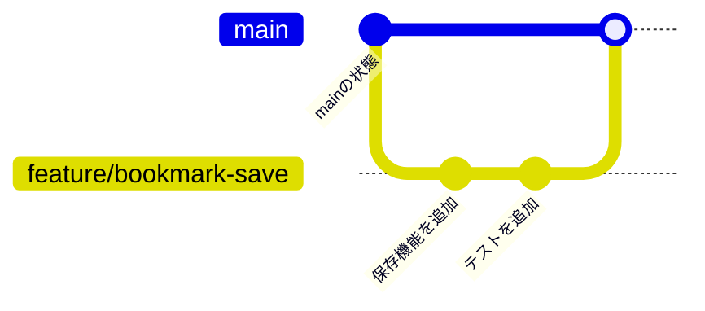

# GitHub FlowとPR

## この章の目的

プルリクエスト（Pull Request。以下PR）ベースの開発を、手を動かしながら理解します。

この章では、先に全体の流れを試します。そのあとで、Branch、Commit、Push、Merge、PRがそれぞれ何をしているのかを整理します。

## 最初に押さえる用語

GitHub Flowでは、いくつかのGit用語が何度も出てきます。最初は細かく覚えなくてよいので、次の対応だけ押さえてください。

| 用語 | 何をするものか | よく使うコマンド |
| --- | --- | --- |
| リポジトリ（Repository） | ファイルと変更履歴をまとめて管理する場所 | `git clone` |
| ブランチ（Branch） | 作業を本流から分けるための場所 | `git checkout -b ブランチ名` |
| コミット（Commit） | 変更履歴を保存する単位 | `git commit -m "メッセージ"` |
| ステージング（Add） | Commitに含める変更を選ぶ操作 | `git add ファイル名` |
| プッシュ（Push） | ローカルのCommitをGitHubへ送る操作 | `git push` |
| PR | GitHub上で変更内容を共有し、レビューを受ける場 | GitHubの画面で作成 |
| マージ（Merge） | Branchの変更を別のBranchへ取り込む操作 | GitHubのMergeボタンなど |

ここで大事なのは、Gitだけで完結する操作と、GitHub上で行う操作があることです。

`git add`、`git commit`、`git push`は手元のターミナルで実行します。一方、PRの作成やレビューは、基本的にはGitHubの画面上で行います。Gitコマンドだけでは、GitHub上のPRレビュー画面は作られません。

## まず手元で流れを試す

ここでは、練習用のフォルダを作り、`git init`から小さなリポジトリを作って試します。既存のプロジェクトを壊す心配がないので、初学者はこちらのほうが安全です。

まず、作業用のフォルダを作ります。

```bash
mkdir github-flow-pr-practice
cd github-flow-pr-practice
```

Gitリポジトリとして初期化します。

```bash
git init
```

最初のファイルを作ります。

```bash
echo "# GitHub Flow PR Practice" > README.md
```

変更を確認します。

```bash
git status
```

READMEをCommitします。

```bash
git add README.md
git commit -m "READMEを追加"
```

現在のBranch名を確認します。

```bash
git branch --show-current
```

表示が`master`になっている場合は、この教材では`main`にそろえます。

```bash
git branch -M main
```

ここまでで、練習用の小さなリポジトリができました。次に、作業Branchを作ります。

```bash
git checkout -b practice/github-flow
```

`git checkout -b`は、新しいBranchを作り、そのBranchへ移動するコマンドです。

次に、READMEを修正します。

```bash
echo "" >> README.md
echo "GitHub Flowを練習します。" >> README.md
```

変更内容を確認します。

```bash
git status
git diff
```

`git status`で変更されたファイルを確認し、`git diff`で実際の差分を確認します。

問題なければ、Commitに含める変更を選びます。

```bash
git add README.md
```

複数ファイルをまとめて追加する場合は、次のようにできます。

```bash
git add .
```

ただし、`git add .`は不要なファイルまで含めることがあります。実行前後に`git status`を見て、意図しないファイルが混ざっていないか確認してください。

変更をCommitします。

```bash
git commit -m "GitHub Flowの練習用変更を追加"
```

すでにGitで管理されているファイルだけをまとめてCommitする場合は、次の書き方もできます。

```bash
git commit -am "GitHub Flowの練習用変更を追加"
```

`git commit -a`は、新しく作ったファイルを自動では含めません。新規ファイルがある場合は、先に`git add ファイル名`が必要です。

Commitできたら、ローカル上ではBranchとCommitの練習は完了です。

GitHub上でPRまで試す場合は、GitHubで空のリポジトリを作り、このローカルリポジトリにリモートを追加します。

```bash
git remote add origin git@github.com:ユーザー名/github-flow-pr-practice.git
```

そのうえで、`main`と作業BranchをGitHubへPushします。

```bash
git checkout main
git push -u origin main
git checkout practice/github-flow
```

```bash
git push -u origin practice/github-flow
```

ここまでで、手元の変更がGitHubに送られました。ただし、この時点ではまだPRは作られていません。

PRは、GitHubのリポジトリ画面で作成します。Push後に表示される案内から作るか、`Pull requests`タブで`New pull request`を押して、取り込み先に`main`、比較元に`practice/github-flow`を選びます。


PRがレビューされ、問題なければGitHub上でMergeします。Merge後、手元の`main`を最新にします。

```bash
git checkout main
git pull
```

その後、Merge済みの作業Branchをローカル環境から削除します。`git branch -d`は、役目が終わったBranchを削除するコマンドです。

```bash
git branch -d practice/github-flow
```

この流れがGitHub Flowの基本です。

## GitとGitHubの違い

GitとGitHubは名前が似ていますが、役割は違います。

**Git**は、ファイルの変更履歴を記録するためのツールです。いつ、誰が、どのファイルを、どのように変更したのかをCommitとして残せます。間違えた変更を戻したり、別の作業をBranchで分けたりできます。

**GitHub**は、Gitのリポジトリをインターネット上で共有し、チームで開発するためのサービスです。GitHubには、PR、コードレビュー、Issue、Actionsによる自動テストなど、チーム開発を支援する機能があります。

Gitだけでも個人の変更履歴は管理できます。しかし、チームで開発する場合は「変更をどのように共有するか」「誰が確認するか」「いつ本流へ取り込むか」を決める必要があります。そのためにGitHubのPRを使います。

## Branchとは

Branchは、変更作業を本流から分けて進めるための仕組みです。

多くのリポジトリでは、`main` Branchを安定した本流として扱います。新しい機能追加や修正を直接`main`にCommitすると、作業途中のコードや未確認の変更が本流に入ってしまいます。

そこで、作業ごとにBranchを作ります。

```bash
git checkout -b feature/bookmark-save
```

このBranch上でCommitを作れば、`main`にはまだ影響しません。作業が終わって確認できたら、PRを作り、レビューを受けてから`main`へ取り込みます。



Branchは「作業用の一時的な場所」と考えると分かりやすいです。作業が終わって`main`へ取り込まれたら、そのBranchは役目を終えます。

## PRとは

PRは、Branchで作った変更を、別のBranchへ取り込んでもらうための依頼です。

PRでは、次のことをまとめて確認できます。

- どのファイルが変更されたか
- どのような差分があるか
- なぜその変更をしたのか
- テストやCIが通っているか
- レビュアーがどのようなコメントをしたか
- 変更を`main`へ取り込んでよいか

PRは、ローカルのGitリポジトリの中に作られるものではありません。GitHubにBranchをPushしたあと、GitHub上で作るレビュー用のページです。

つまりPRは、単なる「マージ依頼」ではありません。変更の目的、内容、確認結果、レビューコメントを1か所に集めるための場です。

## なぜPRベースで開発するのか

PRベースで開発する理由は、変更を安全にチームへ共有するためです。

1つ目の理由は、変更が見えることです。PRを作ると、差分が一覧で表示されます。レビュアーは「何が変わったのか」をCommit履歴やファイル差分から確認できます。

2つ目の理由は、レビューできることです。実装者以外の人がコードを読むことで、考慮漏れ、仕様とのずれ、既存機能への影響に気づきやすくなります。

3つ目の理由は、CIを実行できることです。CIとは、テスト、Lint、Buildなどを自動で実行する仕組みです。人間のレビューだけでは見落とす問題も、機械的なチェックで早く検出できます。

4つ目の理由は、判断の履歴が残ることです。「なぜこの実装にしたのか」「どのような指摘があったのか」「どの確認をしてからMergeしたのか」がPRに残ります。あとから同じ箇所を直すときにも役立ちます。

PRベースの開発では、変更をいきなり本流へ入れるのではなく、確認してから入れます。この一手間が、チーム開発の安全性を高めます。

## レビューしやすいPRとは

レビューしやすいPRには、いくつかの共通点があります。

- 目的が明確である
- 変更範囲が小さい
- 不要な整形や関係のない修正が混ざっていない
- 何を確認したかが書かれている
- 特に見てほしい観点が示されている

まず、目的が明確であることが大切です。「何を解決するための変更なのか」がPR本文に書かれていると、レビュアーは差分を読む前に背景を理解できます。

次に、差分が小さいことも重要です。変更範囲が絞られていると、レビュアーは集中して確認できます。必要のない整形や関係のないリファクタリングが混ざっていないことも大切です。

### 小さなPRの利点

PRは小さく作るほどレビューしやすくなります。

たとえば、画面デザインの変更、APIの追加、データベース構造の変更、既存コードの大規模なリファクタリングを1つのPRにまとめると、レビュアーは何を中心に見ればよいか分かりにくくなります。

比較すると、次のようになります。

| 比較項目 | 大きすぎるPR | 小さなPR |
| --- | --- | --- |
| 目的 | 変更の目的が複数あり、説明がぼやけやすい | 目的が1つに絞られている |
| 差分 | 差分が多く、読み終えるまで時間がかかる | 差分が少なく、変更を追いやすい |
| レビュー | 見る観点が多く、レビューが後回しになりやすい | 確認観点が明確で、早くレビューしやすい |
| 修正 | 指摘対応の影響範囲が広がりやすい | 手戻りが小さい |
| Merge | 他の変更と衝突しやすい | 取り込みやすい |

目安として、PRの説明を1文で言えない場合は、分けられないか考えてみましょう。

良い例は「ブックマーク一覧にOGP画像を表示する」です。悪い例は「ブックマーク周りをいろいろ改善する」です。後者は範囲が広すぎて、何を確認すればよいか分かりにくくなります。

### PR本文に書くこと

確認方法が書かれているPRもレビューしやすくなります。たとえば「`npm test`を実行した」「画面でブックマークを追加できることを確認した」のように、実装者が何を確認したかを書くと、レビュアーも同じ観点で確認できます。

PR本文には、最低限次の内容を書くとよいです。

```markdown
## 目的

なぜこの変更が必要なのかを書く。

## 変更内容

何を変更したのかを箇条書きで書く。

## 確認方法

実行したコマンドや、画面で確認した操作を書く。

## レビューしてほしい観点

特に見てほしい点や迷っている点を書く。
```

PRは、コードだけを見てもらう場所ではありません。レビュアーが変更の背景を理解し、適切に確認できるようにするためのコミュニケーションの場です。
