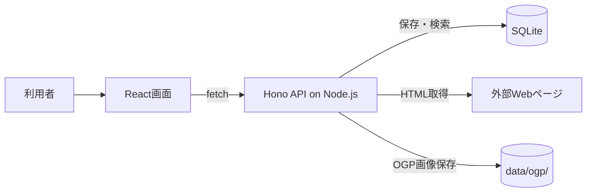

# デモアプリについて

## この章の目的

ハンズオンで扱うデモアプリの概要を理解します。

この章では、すでにあるデモアプリに対して、何を実装するのかを先に押さえます。細かな環境構築や起動方法は、次の「開発環境を準備する」章で扱います。

デモアプリのリポジトリは次のURLで確認できます。アプリは次の章でローカル環境にcloneして起動します。

- リポジトリ: [https://github.com/goofmint/bookmark-demo](https://github.com/goofmint/bookmark-demo)

## Bookmark Demoとは

Bookmark Demoは、URLを保存して後から見返すための個人用ブックマークアプリです。

現在のアプリでは、主に次の操作ができます。

- URLを入力してブックマークを追加する
- 保存済みブックマークのURL、タグ、メモを編集する
- 不要なブックマークを削除する
- URL、タイトル、タグ、メモを対象にキーワード検索する
- ブックマーク一覧をページ単位で表示する

ブックマークを追加すると、サーバー側でリンク先のHTMLを取得し、`<title>`を読み取ってタイトルとして保存します。タイトル取得に失敗した場合でも、URLをタイトルとして保存します。

## ハンズオンで作るもの

この教材では、Bookmark DemoにOGP取得機能を実装します。

OGPとは、SNSなどでURLを共有したときに表示される、ページの概要情報です。OGP画像があるページでは、その画像を取得してブックマークに表示できるようにします。

この章では、どんな機能を追加するのかを先に理解します。実装の手順やローカル環境の準備は、次の章から順番に進めます。

## 利用している技術

Bookmark Demoは、Reactで画面を作り、HonoでAPIを作り、Node.js上で動くローカルWebアプリです。フロントエンドはVite、APIはローカルサーバーとして起動します。

| 技術 | このアプリでの役割 |
| --- | --- |
| [React](https://react.dev/) | ブラウザ上の画面を作る |
| [Vite](https://vite.dev/) | Reactアプリを開発、ビルドする |
| [TypeScript](https://www.typescriptlang.org/) | 型を使ってJavaScriptを安全に書く |
| [Hono](https://hono.dev/) | Node.js上でAPIを作る |
| [SQLite](https://www.sqlite.org/) | ブックマークを保存するローカルデータベース |
| [Vitest](https://vitest.dev/) | APIやUIのテストを実行する |

## システム構成

アプリ全体の流れは次のようになります。

ブックマーク一覧を表示するとき、React画面は`/api/bookmarks`を呼び出します。APIはSQLiteからブックマークを読み出し、JSONとして返します。

ブックマークを追加するとき、React画面はURLをAPIへ送ります。APIはURLを正規化し、リンク先ページの`<title>`を取得し、SQLiteへ保存します。OGP画像が見つかった場合は、画像ファイルをローカルの `data/ogp/` に保存します。

## なぜこの題材を使うのか

このアプリは、画面、API、データベース、テストがひとまとまりになっています。小さいのに、実際のWebアプリで起きる変更の流れを追いやすいので、学習用の題材として扱いやすいです。

この教材では、まず実装対象の機能の全体像を理解し、次の「開発環境を準備する」章で実際にローカル環境を整えます。
