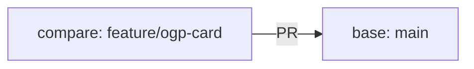

# PRを作成する

## この章の目的

実装した変更をプルリクエスト（Pull Request。以下PR）として共有し、レビューを受けられる状態にします。

## Feature Branchを作る

PRを作る前に、まず作業用のBranchを作ります。`main`は本流として扱い、作業途中の変更を直接入れないようにします。

最初に、現在のBranchを確認します。

```bash
git branch --show-current
```

`main`にいる場合は、最新の状態を取得してから作業Branchを作ります。

```bash
git pull
git checkout -b feature/ogp-card
```

`feature/ogp-card`はBranch名の例です。Branch名は、作業内容が分かる名前にします。

| 目的 | Branch名の例 |
| --- | --- |
| 新機能を追加する | `feature/bookmark-search` |
| 不具合を修正する | `fix/empty-title-error` |
| ドキュメントを更新する | `docs/github-flow-guide` |
| リファクタリングする | `refactor/bookmark-service` |

Branch名はチームによってルールが違うことがあります。プロジェクトに既存の命名ルールがある場合は、それに合わせます。

## Commitを作る

実装が終わったら、Commitを作ります。Commitは、変更履歴の1単位です。

まず、変更されたファイルを確認します。

```bash
git status
```

次に、差分を確認します。

```bash
git diff
```

`git diff`を見ると、どの行を追加、変更、削除したのかが分かります。Commitする前に、自分が意図していない変更が混ざっていないか確認しましょう。

問題なければ、Commitに含めるファイルを選びます。

```bash
git add src/components/BookmarkCard.tsx
git add src/components/BookmarkCard.module.css
```

すべての変更をまとめて追加する場合は、次のコマンドも使えます。

```bash
git add .
```

ただし、`git add .`は現在のディレクトリ以下の変更をまとめて追加します。不要なファイルが混ざっていないか、事前に`git status`で確認してください。

Commitを作ります。

```bash
git commit -m "ブックマークカードにOGP画像を表示"
```

すでにGitで管理されているファイルだけをまとめてCommitする場合は、次のコマンドも使えます。

```bash
git commit -am "ブックマークカードにOGP画像を表示"
```

`git commit -a`は、新しく作成したファイルをCommitに含めません。新規ファイルがある場合は、先に`git add ファイル名`を実行してください。

Commitメッセージは「何をしたか」が分かるように書きます。

良い例です。

```text
ブックマークカードにOGP画像を表示
URL未入力時のバリデーションを追加
READMEにセットアップ手順を追記
```

分かりにくい例です。

```text
修正
対応
いろいろ変更
```

Commitは、あとから履歴を読む人のために残ります。未来の自分やチームメンバーが見て、変更内容を理解できる単位にしましょう。

## PRを作成する

Commitを作ったら、BranchをGitHubへPushします。Pushは、手元のCommitをGitHub上のリポジトリへ送る操作です。

```bash
git push -u origin feature/ogp-card
```

初回Pushでは`-u origin ブランチ名`を付けます。これにより、次回以降は次のように短くPushできます。

```bash
git push
```

Push後、GitHubのリポジトリ画面を開くと、PR作成ボタンが表示されることがあります。

PRはローカルのGitコマンドだけで作るものではありません。ローカルでBranchを作り、Commitし、Pushしたあと、GitHub上でレビュー用のPRページを作ります。

PR作成ボタンが表示されない場合は、GitHub上で次の手順を行います。

1. リポジトリの画面を開く
2. `Pull requests`タブを開く
3. `New pull request`を押す
4. base Branchに`main`を選ぶ
5. compare Branchに作業Branchを選ぶ
6. 差分を確認する
7. タイトルと本文を書く
8. `Create pull request`を押す

base Branchは「取り込み先」です。多くの場合は`main`です。compare Branchは「今回の変更が入っているBranch」です。



PRを作る前に、GitHub上の差分を一度読み直しましょう。ローカルでは気づかなかった不要な変更や、説明不足の変更に気づけることがあります。

## 実装意図を書く

PR本文には、実装意図を書きます。レビュアーは、コード差分だけでは「なぜこの変更が必要なのか」までは分からないことがあります。

最低限、次の4つを書くとレビューしやすくなります。

```markdown
## 目的

ブックマーク一覧でリンク先の内容を把握しやすくするため、OGP画像を表示します。

## 変更内容

- ブックマークカードにOGP画像の表示領域を追加
- OGP画像がない場合はプレースホルダーを表示
- 表示崩れを防ぐため、画像サイズを固定

## 確認方法

- `npm run typecheck`
- `npm run build`
- ブックマーク一覧画面でOGP画像あり、なしの表示を確認

## レビューしてほしい観点

- OGP画像がない場合の表示が分かりにくくないか
- 画像サイズの指定が既存デザインに合っているか
```

「目的」には、変更が必要になった理由を書きます。「変更内容」には、実際に変えたことを書きます。「確認方法」には、実行したコマンドや画面操作を書きます。「レビューしてほしい観点」には、不安な点や特に見てほしい点を書きます。

レビューしてほしい観点を書くと、レビュアーは重要なところから確認できます。たとえば、UIの見え方に迷っているなら、そのことを明示します。仕様の解釈に不安があるなら、それも書きます。

## PRを更新する

レビューコメントを受けたら、同じBranchで修正します。

```bash
git status
git diff
git add .
git commit -m "レビュー指摘を反映"
git push
```

同じBranchへPushすると、既存のPRにCommitが追加されます。PRを作り直す必要はありません。

レビュアーから質問された場合は、すぐにコードを直す前に、意図を説明してもかまいません。レビューは一方的な指示ではなく、よりよい変更にするための会話です。

## Merge前に確認すること

PRをMergeする前に、次の点を確認します。

- PRの目的が本文に書かれている
- 不要なファイル変更が含まれていない
- CIが成功している
- 必要なレビューが終わっている
- 指摘に対応済み、または対応しない理由を説明済み
- ローカルまたは画面上で動作確認している

問題がなければ、GitHub上でMergeします。Merge後は、作業Branchを削除できます。

ローカル環境も最新化します。

```bash
git checkout main
git pull
git branch -d feature/ogp-card
```

作業Branchを削除しても、PRやCommitの履歴はGitHub上に残ります。

## よくあるつまずき

`main`で作業を始めてしまった場合は、まだCommitしていなければBranchを作るだけで移動できます。

```bash
git checkout -b feature/forgot-branch
```

Commit済みの場合でも、現在のCommitを含んだBranchを作れます。

```bash
git checkout -b feature/forgot-branch
```

Push時にエラーが出る場合は、Branch名やリモート名を確認します。

```bash
git remote -v
git branch --show-current
```

差分に不要なファイルが含まれている場合は、Commit前であれば次のようにステージングから外せます。

```bash
git restore --staged ファイル名
```

作業内容そのものを戻したい場合は、影響が大きくなることがあります。特にチーム開発では、履歴を大きく書き換える操作を行う前に、チームのルールを確認してください。
