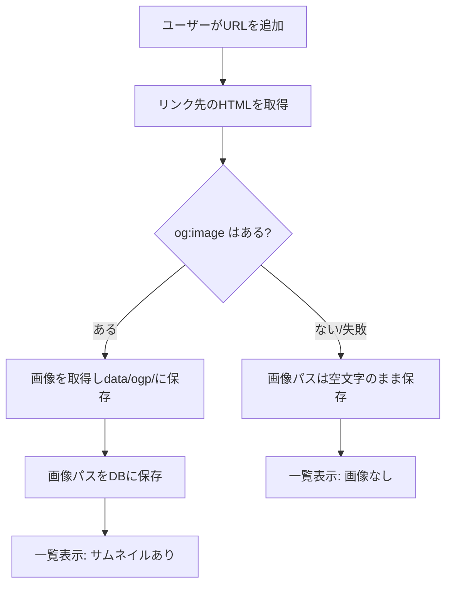

# OGP取得機能を実装する

## この章の目的

Bookmark Demoに「OGP画像をサムネイルとして表示する機能」を追加します。

この章のゴールは、**自分でコードを1行ずつ書くこと**ではありません。**AIコーディングツールに正しく指示を出して、レビューしやすい変更を作ること**です。実装が終わると、ブックマーク一覧にリンク先の画像が並び、次の章でその変更をPRにしてCodeRabbitのレビューを受けられる状態になります。

:::note[この章の進め方]
このハンズオンでは、AIコーディングツール（Claude Code、Cursor、GitHub Copilot など、どれでも構いません）を使って実装します。この章には、そのまま貼り付けて使える**サンプルプロンプト**を用意しています。

AIがうまく実装できなかったときのために、章の最後に[完成版を丸ごとダウンロードして差し替える方法](#fallback)も用意しています。詰まったら遠慮なくそちらを使ってください。
:::

## OGPとは \{#what-is-ogp}

**OGP**（Open Graph Protocol）は、Webページが「このページをSNSなどで共有するときは、こういうタイトル・説明・画像を使ってください」と宣言するための仕組みです。

たとえばニュース記事のURLをXやSlackに貼ると、記事の画像つきのカードが表示されます。あれはOGPの情報を読み取って表示されています。

OGPはHTMLの`<head>`内に、次のような`<meta>`タグとして書かれています。

```html
<meta property="og:title" content="記事のタイトル" />
<meta property="og:description" content="記事の概要" />
<meta property="og:image" content="https://example.com/cover.png" />
```

今回はこのうち **`og:image`（ページの代表画像）** を取得して、ブックマーク一覧にサムネイルとして表示します。

:::note[なぜ画像をそのまま使わず保存するのか]
他サイトの画像URLを直接``に指定すると、相手サイトが画像を消したり差し替えたりした瞬間に、こちらの表示も壊れます。これを避けるため、今回は**画像を一度ローカルの保管場所（`data/ogp/`）にコピーしてから表示**します。このフォルダはアプリ起動時に自動で作られます。
:::

## 今回実装する範囲 \{#scope}

今回追加するのは、次の5つです。

| # | やること | 主に変わるファイル |
| --- | --- | --- |
| 1 | ブックマークに「OGP画像のパス」を保存する列を追加する | `migrations/0003_add_ogp_image.sql`（新規） |
| 2 | URLからOGP画像を取得してローカルに保存する処理を作る | `src/server/ogp.ts`、`src/server/storage.ts` |
| 3 | ブックマーク追加・更新時に2を呼び出し、画像を配信するAPIを足す | `src/server/app.ts`、`src/shared/bookmarks.ts` |
| 4 | 一覧画面にサムネイルを表示する | `src/client/App.tsx`、`src/client/styles.css` |
| 5 | 1〜4のテストを追加する | `test/ogp.test.ts`（新規）ほか |

機能の方針は次のとおりです。これは実装をAIに任せるときの「仕様」になるので、しっかり押さえてください。

- OGP画像の取得は **おまけ（best-effort）** とする。画像が無い・取得に失敗したページでも、ブックマークの保存自体は必ず成功させる。
- 画像が無い場合は、OGP画像のパスを **空文字** にして、一覧ではサムネイルを表示しない。
- 保存する画像は **本物の画像ファイル（PNG/JPEG/WebP/GIF/AVIF）** だけにする。サイズが大きすぎるものは保存しない。
- 保存した画像は直接公開せず、APIの `/ogp/:name` 経由で配信する。

## 実装の全体像 \{#flow}

ブックマークを追加したときの流れは、次のようになります。



## AIコーディングの準備 \{#prepare-ai}

[開発環境を準備する](environment-setup)の手順がすべて終わっていることを確認します。アプリがローカルで起動できる状態が前提です。

次に作業用のBranchを作ります。`main`はそのまま残し、変更は専用のBranchで行います。

```bash
git checkout main
git pull
git checkout -b feature/ogp-image
```

AIコーディングツールを、この`bookmark-demo`フォルダで開きます。

:::note[AIに前提を伝えるコツ]
プロンプトの最初に「どんなアプリか」を一言添えると、AIの精度が上がります。次の一文を、各プロンプトの前に付けて使うとよいです。

> これは Node.js + Hono + React + SQLite で動くローカル用のブックマークアプリです。データベースは `data/bookmarks.sqlite`、OGP画像は `data/ogp/` に保存します。既存のコードのスタイルとコメントの粒度に合わせてください。
:::

## サンプルプロンプト \{#prompts}

ここからは、ステップごとのサンプルプロンプトです。**1つずつ順番に**実行し、その都度`git diff`で変更を確認してください。一度に全部お願いするより、ステップを分けたほうがAIの実装は安定し、レビューもしやすくなります。

### ステップ1：データベースに列を追加する

```prompt
migrations フォルダに 0003_add_ogp_image.sql という新しいマイグレーションを作ってください。
bookmarks テーブルに ogp_image_url という TEXT 列を追加します。
NOT NULL で、デフォルト値は空文字 '' にしてください。
既存の行や seed データには og:image が無いので、空文字で問題ないことをコメントで説明してください。
```

作成できたら、次にサーバーを起動したときにマイグレーションが自動で適用されます。

### ステップ2：OGP画像を取得して保存する処理

```prompt
src/server/ogp.ts と src/server/storage.ts を必要に応じて変更してください。次の関数を用意します。

1. extractOgImageUrl(html, baseUrl): HTML文字列から最初の og:image のURLを取り出す。
   - <meta> タグを走査し、property または name が "og:image"（"og:image:url" も可）のものを探す
   - content 属性の値を取り出す
   - 相対URLは baseUrl で絶対URLに解決する
   - http/https 以外は null を返す
   - 見つからなければ null を返す

2. storeOgpImage(pageUrl, storageDir, fetcher = fetch): 戻り値は string。
   - pageUrl の HTML を取得（タイムアウト5秒、User-Agent を付ける）
   - content-type が text/html でなければ "" を返す
   - extractOgImageUrl で画像URLを取得、無ければ "" を返す
   - 画像を取得し、content-type が image/png, image/jpeg, image/webp, image/gif,
     image/avif のいずれかでなければ "" を返す
   - サイズが0、または5MB超なら "" を返す
   - crypto.randomUUID() を使って <uuid>.<拡張子> というファイル名を作り、`storageDir` に保存する
   - 保存したパス "/ogp/<uuid>.<拡張子>" を返す
   - どこかで失敗したら必ず "" を返す（ブックマーク保存を止めないため）

クラスは使わず、既存コードと同じ関数スタイルで書いてください。
なぜ "" を返すのか、なぜ画像種別を絞るのかをコメントで説明してください。
```

:::note[`fetcher = fetch` を引数にする理由]
テストのときに本物の通信をせず、ニセのレスポンスを差し込めるようにするためです。AIに「テストしやすい設計にして」と伝えると、こうした工夫を入れてくれます。
:::

### ステップ3：APIへ統合し、画像を配信する

```prompt
src/shared/bookmarks.ts の Bookmark 型に ogpImageUrl: string を追加してください。

src/server/app.ts を次のように変更してください。
- BookmarkRow 型と toBookmark に ogp_image_url / ogpImageUrl を追加（既存行は "" にフォールバック）
- 一覧取得・作成・更新の SQL に ogp_image_url 列を追加
- POST /api/bookmarks と PUT /api/bookmarks/:id で、保存前に
  storeOgpImage(url, storageDir) を呼び、その戻り値を ogp_image_url として保存
- GET /ogp/:name ルートを追加。ローカル保存した画像を読み込み、
  無ければ 404 JSON、あれば content-type を引き継いで返す。
  cache-control: public, max-age=86400, immutable を付ける

OGP取得が失敗してもブックマーク保存は成功する作りを必ず維持してください。
既存のコメントの書き方に合わせてください。
```

### ステップ4：一覧にサムネイルを表示する

```prompt
src/client/App.tsx で、ブックマーク1件の表示部分（編集フォームではない通常表示）に、
bookmark.ogpImageUrl があるときだけ  を出してください。
- className="bookmark-thumb"、alt=""、aria-hidden="true"、loading="lazy"
- 画像が無いときは何も表示しない

src/client/styles.css に .bookmark-thumb のスタイルを追加してください。
- 幅120px・高さ90px固定、object-fit: cover、角丸、薄い枠線
- サムネイルがあるときだけ画像用の列ができるよう :has(.bookmark-thumb) を使う
- スマホ幅では少し小さいサイズに調整する
既存のレイアウト（grid）を壊さないでください。
```

### ステップ5：テストを追加する

```prompt
次のテストを Vitest で追加してください。

test/ogp.test.ts（新規）
- extractOgImageUrl: 絶対URL抽出 / 相対URL解決 / og:image無しでnull /
  http(s)以外を除外
- storeOgpImage: 画像を保存してパスを返す / og:image無しで "" /
  許可外のcontent-typeで "" / ページ取得失敗で ""
  （fetcher 引数にニセの fetch を渡して通信しない形にする）

test/worker.test.ts に、作成時に ogp_image_url が保存されること、
GET /ogp/:name が画像を返すこと、無いとき404になることを追加。

test/App.test.tsx に、ogpImageUrl があるとサムネイルが表示され、
無いと表示されないことを追加。

既存テストの書き方・モックの作り方に合わせてください。
```

実装が一通り終わったら、ビルドとテストを実行します。

```bash
npm run build
npm test
```

`npm run build`は型チェックも兼ねています。エラーが出たらメッセージをそのままAIに貼り、「このエラーを直して」と伝えると修正してくれます。

## AIコーディングのコツ \{#tips}

- **一度に全部頼まない。** ステップを分け、`git diff`で都度確認します。差分が小さいほど、間違いに早く気づけます。
- **仕様を曖昧にしない。** 「いい感じに」ではなく「失敗時は空文字を返す」のように、判断基準を言葉で渡します。
- **エラーは丸ごと渡す。** ターミナルのエラー文をそのまま貼るのが、最も早い直し方です。
- **動いているものを壊させない。** 「既存の一覧取得APIの挙動は変えないで」のように、守ってほしい部分を明示します。
- **AIの実装を鵜呑みにしない。** この後CodeRabbitのレビューを受けます。自分でも`git diff`を読み、説明できる状態にしておきます。

## うまくいかないとき：完成版を差し替える \{#fallback}

AIの実装がどうしても通らないときは、完成版のコードを取得して差し替えられます。**答え合わせとしても使えます。**

完成版は、デモリポジトリの`feat/ogp-image`というBranchにあります。

- 参照先: [https://github.com/goofmint/bookmark-demo/tree/feat/ogp-image](https://github.com/goofmint/bookmark-demo/tree/feat/ogp-image)

### 1. Zipでダウンロードする

ブラウザで次のURLを開くと、`feat/ogp-image`Branchの中身がZipでダウンロードされます。

```text
https://github.com/goofmint/bookmark-demo/releases/download/ogp/ogp.zip
```

ダウンロードしたZipを解凍すると、`ogp`というフォルダができます。これは**完成版のコード一式**です。自分の`bookmark-demo`フォルダとは別の場所に置いておきます。

:::note[GitHub画面からダウンロードする場合]
上のURLが分かりにくければ、[リポジトリのページ](https://github.com/goofmint/bookmark-demo)を開き、右側のReleaseからOGPを選び、Assetsにある **「ogp.zip」** のリンクをクリックしてもダウンロードできます。
:::

### 2. フォルダを差し替える

今回の変更は、すべて次のフォルダとファイルの中に収まっています。展開したフォルダにある、これらのフォルダとファイルで、自分の`bookmark-demo`フォルダの同じフォルダやファイルを**まるごと置き換え**ます。

| 置き換えるフォルダとファイル | 中身 |
| --- | --- |
| `src` | 画面とAPIのコード |
| `migrations` | データベースの設計図（`0003`が追加されます） |
| `test` | テストコード |
| `vite.config.ts` | Viteの設定（OGP画像配信のために変更） |
| `vitest.config.ts` | Vitestの設定（OGP画像配信のために変更） |

### 3. 反映して動作確認する

差し替えたら、ビルドとテストを実行します。

```bash
npm run build
npm test
```

どちらもエラーなく終われば、差し替え成功です。

## 動作確認 \{#verify}

ローカルサーバーを起動します。

```bash
npm run dev
```

表示されたViteのURL（`http://127.0.0.1:5173`など）をブラウザで開き、次を確認します。

- OGP画像があるページのURL（ニュース記事やブログ記事など）を追加すると、一覧にサムネイルが表示される
- OGP画像が無いページを追加しても、エラーにならずブックマークが保存される（サムネイルは出ない）
- 既存のブックマークの編集・削除・検索が、これまでどおり動く

確認できたら、`Ctrl + C`でサーバーを止めます。

## ここまでのまとめ

この章では、AIコーディングを使ってBookmark DemoにOGP取得機能を実装しました。

- OGP（特に`og:image`）の役割を理解した
- ステップを分けたサンプルプロンプトで実装した
- 詰まったときは完成版をZipで取得して差し替えられるようにした
- ビルド・テスト・画面で動作を確認した

次の章では、この変更をCommitし、プルリクエスト（PR）として共有して、CodeRabbitのレビューを受けます。
