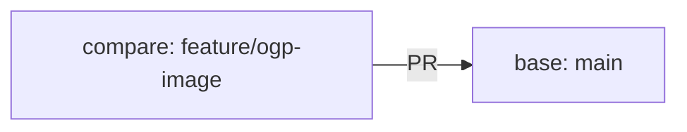

# PRを作成する

## この章の目的

[OGP取得機能を実装する](ogp-implementation)で作った変更を、Commitし、GitHubへPushして、PR（Pull Request）にします。

この章のゴールはPRが作成できた状態です。PRさえできれば、次の章でCodeRabbitのレビューを受けられます。

Branch・Commit・Push・PRが何をする操作かは[GitHub FlowとPR](github-flow-pr)で説明済みなので、ここでは繰り返しません。今回のOGP機能を、その流れに実際に乗せていきます。

## いまの状態を確認する

前の章で、すでに作業用Branch（`feature/ogp-image`）を作り、その上で実装と動作確認まで終わっています。まずは、自分が今そのBranchにいることを確認します。

```bash
git branch --show-current
```

`feature/ogp-image`と表示されればOKです。`main`と表示された場合は、前の章のBranch作成を飛ばしている可能性があります。[OGP取得機能を実装する](ogp-implementation)のBranch作成からやり直してください。

次に、何が変わったかを確認します。

```bash
git status
git diff
```

`git status`で変更・追加されたファイルの一覧、`git diff`で実際の差分が見られます。前の章で触ったファイル（`migrations/0003_add_ogp_image.sql`、`src/server/ogp.ts`、`src/server/storage.ts`、`src/server/app.ts`、`src/client/App.tsx`、テストなど）だけが出ているか、意図しないファイルが混ざっていないかをここで見ておきます。

## Commitする

今回はOGP機能の追加という1つのまとまった変更なので、関係するファイルをまとめて1つのCommitにします。

新しく作ったファイル（`0003_add_ogp_image.sql`や`ogp.ts`など）があるので、`git add`で明示的に追加します。

```bash
git add migrations/ src/ test/
```

追加されたかを`git status`でもう一度確認し、問題なければCommitします。

```bash
git commit -m "ブックマーク一覧にOGP画像を表示する"
```

Commitメッセージは「何をしたか」が後から読んで分かるように書きます。`修正`や`いろいろ変更`のような、見ても内容が分からないメッセージは避けます。今回のメッセージはそのままPRのタイトルにも流用できます。

## GitHubへPushする

CommitをGitHubへ送ります。`feature/ogp-image` Branchを初めてPushするので、`-u origin feature/ogp-image`を付けます。

```bash
git push -u origin feature/ogp-image
```

初回に`-u`を付けておくと、次回以降はこのBranchでは`git push`だけで送れるようになります。

## PRを作成する

PushしたあとにGitHubのリポジトリ画面を開くと、`feature/ogp-image`からPRを作る案内が表示されることが多いので、それをクリックします。

案内が出ない場合は、GitHubの画面で次の手順を行います。

1. リポジトリの画面を開く
2. `Pull requests`タブを開く
3. `New pull request`を押す
4. base Branchに`main`を選ぶ
5. compare Branchに`feature/ogp-image`を選ぶ
6. 差分を確認する

baseは「取り込み先」、compareは「今回の変更が入っているBranch」です。今回は次の向きになります。



baseとcompareを逆に選ぶと差分が空になったり、意図しない比較になります。`main` ← `feature/ogp-image`の向きになっているか、ここで一度確認してください。

差分が確認できたら、タイトルと本文を書きます。

### 実装意図を書く

タイトルは、変更内容がひと目で分かる一文にします。先ほど付けたCommitメッセージ（`ブックマーク一覧にOGP画像を表示する`）をそのまま使えば十分です。

本文の書き方は[GitHub FlowとPR](github-flow-pr)で説明したとおりです。今回のOGP機能なら、たとえば次のように書きます。

```markdown
## 目的

ブックマーク一覧でリンク先の内容を把握しやすくするため、OGP画像をサムネイルとして表示する。

## 変更内容

- `ogp_image_url`列を追加するマイグレーションを作成
- URLからOGP画像を取得しローカルに保存する処理を追加
- ブックマーク作成・更新時にOGP画像を取得して保存
- 一覧画面にサムネイルを表示
- 上記のテストを追加

## 確認方法

- `npm run build`
- `npm test`
- 画面でOGP画像あり・なしの両方のURLを追加し、表示と保存を確認

## レビューしてほしい観点

- OGP取得が失敗してもブックマーク保存は成功する作りになっているか
- 保存する画像種別やサイズの制限が適切か
```

「確認方法」と「レビューしてほしい観点」を書いておくと、レビュアー（次の章ではCodeRabbit）が何を中心に見ればよいか分かり、レビューが早く・的確になります。

### PRを確定する

タイトルと本文を書けたら、`Create pull request`を押します。PRページが作られ、変更の差分・Commit・本文が1か所にまとまった状態になります。

ここまでで、この章のゴールは達成です。

## よくあるつまずき

`git push`でエラーが出る

初回Pushで`-u origin feature/ogp-image`を付けず、`git push`だけを実行すると、送り先が決まっておらずエラーになります。初回は`-u`付きで実行してください。

```bash
git push -u origin feature/ogp-image
```

新しく作ったファイルがCommitに入っていない

`git commit -am`は、すでにGitで管理されているファイルしか含めません。今回は`0003_add_ogp_image.sql`や`ogp.ts`など新規ファイルがあるため、これだと取りこぼします。新規ファイルは先に`git add`してからCommitします。Commit後は、次のコマンドでそのCommitに実際に含まれたファイル一覧を確認できます。

```bash
git show --name-only --oneline HEAD
```

入れたかったファイルがすべて並んでいれば大丈夫です。

差分に関係ないファイルが混ざっている

`git status`や`git diff`に、今回の変更と関係ないファイル（ローカル用の生成物など）が出ていることがあります。Commitに含めたくないものは、`git add`する前に外しておきます。すでにステージングした場合は次のコマンドで外せます。

```bash
git restore --staged ファイル名
```

PRの差分が空、または見覚えのない差分になっている

base（取り込み先）とcompare（変更元）を逆に選んでいることがほとんどです。base=`main`、compare=`feature/ogp-image`になっているか確認してください。

## ここまでのまとめ

この章では、OGP機能の変更をPRにしました。

- 前の章で作った`feature/ogp-image`の状態を確認した
- 新規ファイルを含めてCommitした
- GitHubへPushし、`main`向きのPRを作成した
- 実装意図が伝わるPR本文を書いた

これでレビューを受ける準備が整いました。次の章では、このPRに対してCodeRabbitのレビューを受け、その指摘を読み解いていきます。
