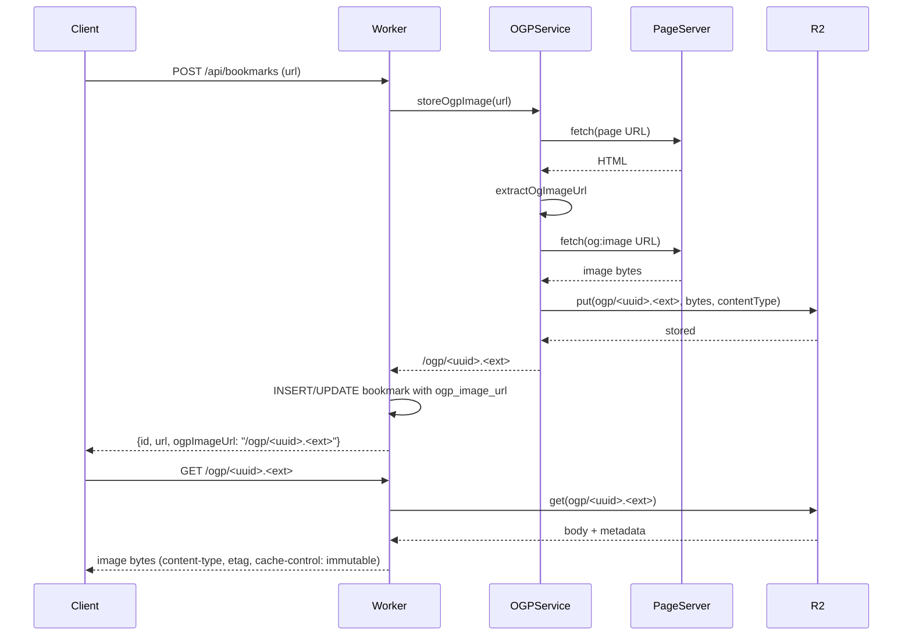

# CodeRabbitレビューを体験する

## この章の目的

[PRを作成する](create-pull-request)でPRを作ったあと、GitHubの画面上で何が起きるかを見ていきます。

PRを作ると、CodeRabbitが自動でレビューを始めます。この章では、そのレビューを**読む → 意味を理解する → 対応する → 再レビューを受ける**までを、実際のサンプルPRを見ながら体験します。

## サンプルPRを開く

この章では、前の章で実装したのと同じOGP機能のPRを題材にします。手元に自分のPRがあればそれを見ながら、無ければ次のサンプルPRを開いて読み進めてください。

- サンプルPR: [https://github.com/goofmint/bookmark-demo/pull/6](https://github.com/goofmint/bookmark-demo/pull/6)

このPRには、CodeRabbitのレビューが実際に付いています。以降の説明は、このPRの中身をそのまま例に使います。

## レビューはいつ始まるか

PRを作成した直後、またはPRに新しいCommitをPushした直後に、CodeRabbitは自動でレビューを始めます。自分で起動する操作は不要です。

レビューには数分かかります。完了すると、PRに次の2種類が現れます。

1. **PR全体に対する1つの大きなコメント**（要約・全体像）
2. **コード差分の特定の行に紐づくコメント**（インラインコメント＝行ごとの指摘）

順番に見ていきます。

## 全体像のコメントを読む

まず、PR画面の上のほうに付く大きなコメントです。ここには「このPRが全体として何をしているか」がまとまっています。**差分を1行ずつ追う前に、ここで変更の全体像を頭に入れる**のが、レビューを読むコツです。

このコメントは、次の要素で構成されています。順番に見ていきます。

### Summary by CodeRabbit

変更内容を「新機能」「テスト」などに分類した、人間向けの短い要約です。

> * **新機能**: OGP画像があるブックマークにサムネイルを表示。画像は遅延読み込み・レスポンシブ対応で、新しい画像配信エンドポイント経由で配信。サムネイルのURLをDBに保存。
> * **テスト**: サムネイルの抽出・保存・配信・表示有無を確認するE2E／ユニットテストを追加。
> * **雑務**: 一時ディレクトリを除外するよう`.gitignore`を更新。

### Walkthrough

変更全体を文章で要約したものです。

> DBに必須の`ogpImageUrl`を持たせ、OGP抽出とR2保存の処理、画像を保存・配信するWorkerのエンドポイント、サムネイル表示のクライアント実装とCSS、表示有無のテストを追加した。

### Changes

どのファイルで何をしたかが1行ずつ整理された表です。差分を開く前に、ここで変更範囲の見当をつけられます。

| 対象ファイル | 内容 |
| --- | --- |
| `src/shared/bookmarks.ts`, `migrations/0003_add_ogp_image.sql`, `src/worker/index.ts` | `Bookmark`型に必須の`ogpImageUrl`を追加。マイグレーションで`ogp_image_url`列（NOT NULL、デフォルト`''`）を追加。Workerの一覧クエリにも列を反映。 |
| `src/worker/ogp.ts`, `test/ogp.test.ts` | `extractOgImageUrl` / `fetchWithTimeout` / `storeOgpImage`を新規追加。og:image抽出、MIME・サイズ検証、R2への保存を行い、配信パスか空文字を返す。テストも追加。 |
| `src/worker/index.ts`, `test/worker.test.ts` | POST/PUTで`storeOgpImage`を呼び出し、`GET /ogp/:name`でR2の画像を配信。テストも追加。 |
| `src/client/App.tsx`, `src/client/styles.css`, `test/App.test.tsx` | `ogpImageUrl`があるときだけ遅延読み込みのサムネイルを表示。CSSと表示有無のテストを追加。 |
| `.gitignore` | `.tmp`を除外対象に追加。 |

### Sequence Diagram

処理の流れが図（シーケンス図）で示されます。



「URL登録 → ページ取得 → og:image抽出 → R2に保存 → 一覧表示」という流れが、コードを読まなくても追えます。

### Estimated code review effort

このPRのレビューにどれくらい手間がかかるかの見積もりです。

> 🎯 3 (Moderate) | ⏱️ ~20 minutes

難易度3（中程度）、所要時間は約20分、という意味です。

### Possibly related PRs

今回の変更と関係しそうな過去のPRが挙がります。背景を把握するのに役立ちます。サンプルPRでは次の2件が挙がっています。

> - bookmark-demo#1: このPRが拡張している、ブックマークアプリの土台となったPR。
> - bookmark-demo#3: 同じブックマークのデータモデルと一覧・編集UIに触れているPR。

### Pre-merge checks

Mergeしてよいかの自動チェックの結果です。サンプルPRでは4項目が合格、1項目が警告になっています。

> 🚥 Pre-merge checks ｜ ✅ 4 ｜ ❌ 1
>
> **警告（1件）**
>
> | チェック名 | 状態 | 内容 |
> | --- | --- | --- |
> | Docstring Coverage | ⚠️ Warning | docstringのカバレッジが0.00%で不足。必要な基準は80.00%。不足している関数にdocstringを書くこと。 |
>
> **合格（4件）**
>
> | チェック名 | 状態 | 内容 |
> | --- | --- | --- |
> | Description Check | ✅ Passed | CodeRabbitの要約が有効なためスキップ。 |
> | Title check | ✅ Passed | タイトルが主要な変更を的確に要約している。 |
> | Linked Issues check | ✅ Passed | 紐づくIssueが無いためスキップ。 |
> | Out of Scope Changes check | ✅ Passed | 紐づくIssueが無いためスキップ。 |

警告はMergeを止めるものではなく、「気になる点があるよ」という注意です。対応するかどうかは自分で判断します。

## インラインコメント（行ごとの指摘）を読む

次が、レビューの本体です。コードの特定の行に対して、CodeRabbitが指摘を付けます。

レビューの先頭には「**Actionable comments posted: 5**」のように、対応を検討すべき指摘が何件あるかが表示されます。サンプルPRには5件付いています。

各インラインコメントは、先頭のバッジで「種類」「重要度」「対応の重さ」が一目で分かるようになっています。サンプルPRの実例で見てみます。

```text
⚠️ Potential issue | 🟠 Major | 🏗️ Heavy lift
Add SSRF guards before fetching page/image URLs.
```

バッジの意味は次のとおりです。

| バッジの種類 | 例 | 意味 |
| --- | --- | --- |
| 種類 | `⚠️ Potential issue` / `🛠️ Refactor suggestion` / `🧹 Nitpick` | バグ・脆弱性の疑いか、改善提案か、ささいなスタイル指摘か |
| 重要度 | 🔴 Critical / 🟠 Major / 🟡 Minor / 🔵 Trivial / ⚪ Info | どれくらい深刻か |
| 対応の重さ | `⚡ Quick win` / `🏗️ Heavy lift` | すぐ直せるか、作りの見直しが必要か |

上の例なら「セキュリティ上の問題の疑い（Potential issue）」「深刻度は高め（Major）」「対応は大変（Heavy lift）」と読めます。バッジを見れば、どれから手を付けるべきかの優先順位がすぐ判断できます。

指摘の本文には、**何が問題か・なぜ問題か**が書かれています。サンプルPRの指摘をいくつか挙げます。

- **SSRFの対策が無い**（Major／セキュリティ）: ユーザーが入力したURLをそのまま取得しているため、社内ネットワークや`localhost`を狙われる恐れがある。
- **登録・更新がOGP取得の完了を待ってしまう**（Major／性能）: 外部ページの取得が遅いと、ブックマーク登録のレスポンスがその分遅くなる。先に保存し、画像取得は後ろで行う設計が望ましい。
- **不正な`og:image`を1つ見つけた時点で走査をやめている**（Minor）: 後ろに正しい`og:image`があっても拾えない。

このように、コード差分だけでは気づきにくい観点（セキュリティ・性能・見落とし）を、根拠つきで指摘してくれます。

## Suggested Changes（提案された修正）を適用する

指摘の中には、修正コードまで提案してくれるものがあります。サンプルPRの「走査をやめている」指摘には、次のような **Committable suggestion**（そのまま反映できる提案）が付いています。

```diff
-      if (resolved.protocol !== "http:" && resolved.protocol !== "https:") {
-        return null;
-      }
+      if (resolved.protocol !== "http:" && resolved.protocol !== "https:") {
+        continue;
+      }
```

このような提案には、GitHubの画面上に **「Commit suggestion」ボタン**が表示されます。押すと、その修正が新しいCommitとしてPRに直接追加されます。手元でコードを書かなくても、ボタン1つで反映できます。

:::warning[ボタンを押す前に、必ず差分を読む]
1クリックで反映できますが、提案が常に正しいとは限りません。**何をどう変える提案なのかを自分で読んで理解してから**適用してください。理解できない提案をそのまま入れると、後で説明できないコードがPRに残ります。
:::

## AIに直してもらう（Prompt for AI Agents）

提案コードが無い指摘や、複数ファイルにまたがる修正には、`🤖 Prompt for AI Agents` という折りたたみが付いています。開くと、AIコーディングツール（Claude CodeやCursorなど）にそのまま貼れる指示文が入っています。

サンプルPRの指示文は、たとえばこう始まっています。

```text
Verify each finding against current code. Fix only still-valid issues, skip the
rest with a brief reason, keep changes minimal, and validate.
```

これは「**指摘を今のコードに照らして検証し、まだ有効なものだけ直す。残りは理由を添えてスキップし、変更は最小限にして検証まで行う**」という意味です。AIに丸投げするのではなく、AI自身に「鵜呑みにせず検証してから直す」よう指示が組み込まれている点がポイントです。

この指示文をAIに渡して修正してもらい、その結果を自分で確認してからCommitします。指摘 → AIで修正 → 自分で確認、という流れになります。

## 対応して再レビューを受ける

指摘に対応したら、その修正を**同じBranchにCommitしてPush**します。PRを作り直す必要はありません。

```bash
git add .
git commit -m "SSRF対策とテストのクリーンアップを追加"
git push
```

Pushすると、CodeRabbitが自動で**再レビュー**を行います。前回の指摘がきちんと直っていれば、その指摘に「✅ Addressed in commit xxxx」と表示され、解決済みとして扱われます。サンプルPRでも、マイグレーションのロールバック注記やテストのクリーンアップの指摘が、後のCommitで対応済みになっています。

新たな指摘が無くなると、CodeRabbitは次のように表示します。

```text
No actionable comments were generated in the recent review. 🎉
```

ここまで来れば、CodeRabbitレビューの一区切りです。

## すべて直す必要はない

指摘は「絶対に従う命令」ではありません。

- **Major・セキュリティ（SSRFなど）は優先して対応**します。影響が大きいからです。
- **Nitpick（ささいな指摘）は取捨選択**してかまいません。サンプルPRにも「あるテストケースを足すとなお良い」という程度の指摘があります。
- **対応しないと判断したものは、理由を返信**します。コメント欄で `@coderabbitai` に話しかけて質問・相談することもできます。

レビューは一方的な指示ではなく、よりよい変更にするための会話です。「なぜこの指摘に従わないのか」を言葉で説明できることが大切です。

## ここまでのまとめ

この章では、PR作成後にGitHub上でCodeRabbitのレビューを体験しました。

- 全体像コメント（Summary・Walkthrough・Changes・図）で変更の全体像をつかんだ
- インラインコメントのバッジ（種類・重要度・対応の重さ）で優先順位を判断した
- Committable suggestionをボタンで、Prompt for AI AgentsをAIで反映する方法を知った
- 同じBranchにPushして再レビューを受け、対応済み表示を確認した
- すべて従う必要はなく、理由を添えてスキップしてよいことを理解した

次の章では、ここで読んだ指摘を題材に、「良いレビューとは何か」をもう一歩踏み込んで考えます。
