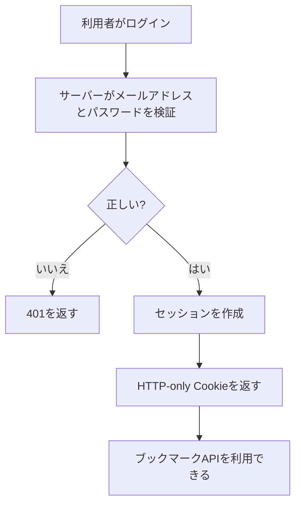
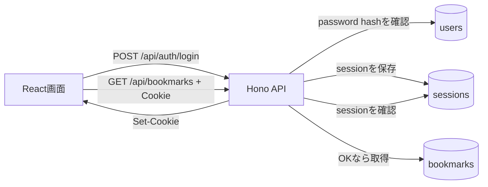

# 認証機能を実装する

## この章の目的

Bookmark Demoに「ログインしている利用者だけがブックマーク機能を使えるようにする認証機能」を追加します。

この章のゴールは、ログイン画面、サインアップ、ログイン、ログアウト、セッション確認、未ログイン時のAPI保護を実装することです。

:::note[この章の進め方]
この章は、次のどちらの進め方でも構いません。

- AIコーディングツール（Claude Code、Cursor、GitHub Copilot、Codex など）を使って、サンプルプロンプトをもとに実装する
- 完成版の差分ファイルをダウンロードして、手元のファイルと差し替える

次章のIDEレビューを体験することが目的なら、完成版の差分を使って先に進んでも構いません。
:::

## 今回作る認証機能 \{#feature}

今回は、外部サービスのOAuthログインではなく、ローカル教材として扱いやすいメールアドレスとパスワードによるログインを実装します。

ログインに成功したら、サーバーはランダムなセッショントークンを作り、ブラウザにはHTTP-only Cookieとして保存します。React画面はCookieの中身を直接読みません。以降のAPIリクエストでは、ブラウザがCookieを自動で送信し、サーバーがセッションを確認します。



## 今回実装する範囲 \{#scope}

今回追加するのは、次の5つです。

| # | やること | 主に変わるファイル |
| --- | --- | --- |
| 1 | ユーザーとセッションを保存するテーブルを追加する | `migrations/0004_add_auth.sql`（新規） |
| 2 | パスワードハッシュ化、セッション作成、Cookie生成の処理を作る | `src/server/auth.ts`（新規） |
| 3 | サインアップ、ログイン、ログアウト、ログイン状態確認APIを追加する | `src/server/app.ts`、`src/shared/auth.ts` |
| 4 | ブックマークAPIを未ログインでは使えないようにする | `src/server/app.ts` |
| 5 | ログイン画面と認証状態に応じた表示を追加する | `src/client/App.tsx`、`src/client/styles.css` |

機能の方針は次のとおりです。これは実装をAIに任せるときの「仕様」になるので、しっかり押さえてください。

- パスワードは平文で保存しない。Node.js標準の`crypto.scrypt`などでハッシュ化して保存する。
- セッショントークンも平文でデータベースに保存しない。Cookieには生のトークンを入れ、DBにはSHA-256などでハッシュ化した値を保存する。
- Cookieには `HttpOnly`、`SameSite=Lax`、`Path=/` を付ける。開発環境では`Secure`を必須にしない。
- セッションには有効期限を持たせる。期限切れのセッションはログイン済みとして扱わない。
- 未ログインでブックマークAPIを呼んだら、`401 Unauthorized`を返す。
- ログアウト時はサーバー側のセッションを削除し、ブラウザ側のCookieも期限切れにする。

:::warning[本番用の完全な認証基盤ではありません]
この章で作るのは、ローカル教材としての認証機能です。本番サービスでは、メール確認、パスワードリセット、レート制限、CSRF対策、監査ログ、セッションのローテーション、アカウントロックなど、追加で考えることがあります。
:::

## 実装の全体像 \{#flow}

ログイン済みかどうかは、サーバー側のセッションで判断します。



画面側は、最初に`GET /api/auth/me`を呼びます。ログイン済みならブックマーク画面を表示し、未ログインならログインフォームを表示します。

## AIコーディングの準備 \{#prepare-ai}

[開発環境を準備する](environment-setup)の手順がすべて終わっていることを確認します。アプリがローカルで起動できる状態が前提です。

次に作業用のBranchを作ります。`main`はそのまま残し、変更は専用のBranchで行います。

```bash
git checkout main
git pull
git checkout -b feature/auth
```

AIコーディングツールで実装する場合は、この`bookmark-demo`フォルダを開きます。

## 完成版の差分を使う場合

自分で認証機能を実装せず、次章のIDEレビューを同じ題材で体験したい場合は、次のZIPから認証機能の差分を取得できます。

- [https://github.com/goofmint/bookmark-demo/releases/download/auth/auth.zip](https://github.com/goofmint/bookmark-demo/releases/download/auth/auth.zip)

ZIPを展開し、`bookmark-demo` の作業ディレクトリに反映すると、認証機能を追加した状態の差分を用意できます。反映後は、VS Codeで `bookmark-demo` フォルダを開き、Gitの変更が表示されていることを確認してください。

:::note[AIに前提を伝えるコツ]
プロンプトの最初に「どんなアプリか」を一言添えると、AIの精度が上がります。次の一文を、各プロンプトの前に付けて使うとよいです。

> これは Node.js + Hono + React + SQLite で動くローカル用のブックマークアプリです。既存のコードのスタイル、型定義、テストの書き方に合わせてください。今回は認証機能を追加しますが、外部OAuthではなくメールアドレスとパスワード、HTTP-only Cookieセッションで実装します。
:::

## サンプルプロンプト \{#prompts}

ここからは、ステップごとのサンプルプロンプトです。1つずつ順番に実行し、その都度`git diff`で変更を確認してください。

ポイントは、SQLや関数の中身を人間が先回りして全部書かないことです。AIエージェントには、まず既存コードを読ませ、プロジェクトの作法に合わせて実装させます。プロンプトでは「何を実現したいか」と「譲れない条件」だけを伝えます。

### ステップ1：サーバー側の認証を実装する

```prompt
既存のサーバー実装、migrations、テストを読んで、メールアドレスとパスワードでログインできる認証機能を追加してください。

含めたいこと:
- 認証に必要なDBマイグレーション
- アカウント作成、ログイン、ログアウト、ログイン状態確認のAPI
- ブックマークAPIの認証必須化

守ってほしいこと:
- パスワードは平文保存しない
- セッショントークンもDBには平文保存しない
- Cookieは HttpOnly / SameSite=Lax / Path=/ を付ける
- ローカル開発で http://127.0.0.1 から動かせるようにする
- ログイン失敗時に、メールアドレスが存在するかどうかを外から判断できないようにする
- 既存のブックマークAPIの挙動は、ログイン済みなら変えない
```

:::note[CookieをReactから読ませない理由]
`HttpOnly`を付けると、JavaScriptからCookieを読めなくなります。React画面がトークンを直接扱わないため、XSSが起きたときにセッショントークンを盗まれにくくなります。
:::

### ステップ2：画面に認証フローを組み込む

```prompt
既存のReact画面を確認し、認証状態に応じて自然に表示が切り替わるようにしてください。

期待する利用体験:
- 未ログインのときは、ブックマーク一覧ではなくログイン/アカウント作成の画面が見える
- ログインまたはアカウント作成に成功したら、これまでのブックマーク画面に入れる
- ログイン中は、どのメールアドレスで利用しているか分かる
- ログアウトでき、ログアウト後はブックマーク一覧が見えない
- セッション切れや401応答を受けた場合は、ログイン画面に戻る

守ってほしい条件:
- 既存のブックマーク操作のUIを大きく作り替えない
- Cookieを使うAPI呼び出しでは、必要に応じて credentials: "include" を指定する
- スタイルは既存の画面になじませる
- 派手なランディングページではなく、操作画面として実用的にする
```

### ステップ3：テストを追加する

```prompt
認証機能のテストを追加してください。

まず既存のテスト構成を確認し、同じ粒度と書き方に合わせてください。

重点的に確認したいこと:
- パスワードやセッショントークンを安全に扱う共通処理が壊れていない
- アカウント作成、ログイン、ログアウト、ログイン状態確認が期待どおり動く
- 未ログインではブックマークAPIを使えない
- ログイン済みなら、既存のブックマークAPIをこれまでどおり使える
- 画面では、未ログイン、ログイン後、ログアウト後の表示切り替えが確認できる

テスト対象のファイル名や分割は、既存のテスト構成に合わせて判断してください。
```

実装が一通り終わったら、ビルドとテストを実行します。

```bash
npm run build
npm test
```

`npm run build`は型チェックも兼ねています。エラーが出たらメッセージをそのままAIに貼り、「このエラーを直して」と伝えると修正してくれます。

## 動作確認 \{#verify}

ローカルサーバーを起動します。

```bash
npm run dev
```

表示されたViteのURL（`http://127.0.0.1:5173`など）をブラウザで開き、次を確認します。

- 最初にログインフォームが表示される
- 新しいアカウントを作成できる
- ログイン後にブックマーク一覧が表示される
- ブックマークの追加、編集、削除、検索がこれまでどおり動く
- ログアウトするとログインフォームに戻る
- ログアウト後にブラウザを更新しても、ブックマーク一覧が表示されない

確認できたら、`Ctrl + C`でサーバーを止めます。

## ここまでのまとめ

この章では、AIコーディングを使ってBookmark Demoに認証機能を実装しました。

- メールアドレスとパスワードによるログインの流れを理解した
- HTTP-only Cookieとサーバー側セッションの役割を理解した
- ステップを分けたサンプルプロンプトで実装した
- ビルド・テスト・画面で動作を確認した

次の章では、この変更に対してIDE上でCodeRabbitのレビューを受け、指摘を読んで修正する流れを体験します。
