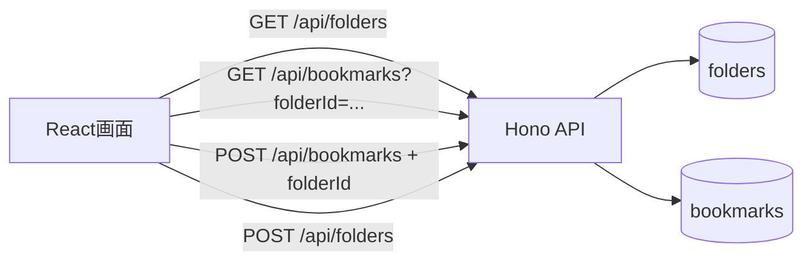

# フォルダ分け機能を実装する

## この章の目的

Bookmark Demoに「ブックマークをフォルダで分類する機能」を追加します。

:::note[この章の進め方]
この章は、AIコーディングツール（Codex CLI、Claude Code、Cursor、GitHub Copilotなど）を使って実装する想定です。
:::

## 今回作るフォルダ分け機能 \{#feature}

現在のBookmark Demoでは、タグや検索でブックマークを探せます。ここに、より大きな分類として **フォルダ** を追加します。

たとえば、次のようにブックマークを分けられるようにします。

| フォルダ | 入れるブックマークの例 |
| --- | --- |
| 技術記事 | 実装ノウハウ、公式ドキュメント、ブログ記事 |
| 読み物 | あとで読みたい長めの記事 |
| 仕事 | 業務で参照するページ |
| 未分類 | まだ分類していないブックマーク |

タグは1件のブックマークに複数付けられる細かい分類、フォルダは1件のブックマークが1つだけ所属する大きな分類として扱います。

## 今回実装する範囲 \{#scope}

今回追加するのは、次の5つです。

| # | やること | 主に変わるファイル |
| --- | --- | --- |
| 1 | フォルダを保存するテーブルと、ブックマークの所属先列を追加する | `migrations/0005_add_folders.sql`（新規） |
| 2 | フォルダ一覧、作成、更新、削除のAPIを追加する | `src/server/app.ts`、`src/shared/folders.ts` |
| 3 | ブックマーク作成・更新時にフォルダを選べるようにする | `src/server/app.ts`、`src/shared/bookmarks.ts` |
| 4 | 画面にフォルダ選択、フォルダ別フィルタ、フォルダ管理UIを追加する | `src/client/App.tsx`、`src/client/styles.css` |
| 5 | APIと画面のテストを追加する | `test/worker.test.ts`、`test/App.test.tsx` ほか |

機能の方針は次のとおりです。

- 初期状態では **未分類** フォルダを用意する。
- 既存のブックマークは、マイグレーション後に未分類へ所属させる。
- 未分類フォルダは削除できない。
- フォルダを削除する場合、そのフォルダに入っていたブックマークは未分類へ移す。
- フォルダ分けを追加しても、既存の検索、タグ、追加、編集、削除の操作を壊さない。

## 実装の全体像 \{#flow}

画面を開いたとき、React画面はブックマーク一覧とフォルダ一覧を取得します。利用者は左側や上部のフォルダ一覧から表示対象を切り替え、ブックマーク作成・編集時に所属フォルダを選びます。



サーバー側では、ブックマークの `folder_id` とフォルダテーブルをJOINして、画面が表示しやすい形で返します。

## AIコーディングの準備 \{#prepare-ai}

[開発環境を準備する](environment-setup)の手順がすべて終わっていることを確認します。アプリがローカルで起動できる状態が前提です。

次に作業用のBranchを作ります。`main`はそのまま残し、変更は専用のBranchで行います。

```bash
git checkout main
git pull
git checkout -b feature/bookmark-folders
```

AIコーディングツールを、この`bookmark-demo`フォルダで開きます。

:::note[AIに前提を伝えるコツ]
プロンプトの最初に「どんなアプリか」を一言添えると、AIの精度が上がります。次の一文を、各プロンプトの前に付けて使うとよいです。

> これは Node.js + Hono + React + SQLite で動くローカル用のブックマークアプリです。既存のコードのスタイル、型定義、テストの書き方に合わせてください。今回はブックマークを1階層のフォルダで分類できるようにします。
:::

## サンプルプロンプト \{#prompts}

ここからは、ステップごとのサンプルプロンプトです。各ステップのあとに`git diff`で変更を確認してください。

### ステップ1：データベースとAPIを実装する

```prompt
既存のサーバー実装とデータベース構成を確認して、ブックマークをフォルダで分類するための「データベース」と「サーバーAPI」だけを実装してください。

このステップでは次のファイルだけを変更します。画面（React）の変更やテストの追加は、別のステップで行うのでこのステップでは行わないでください。

- マイグレーション：フォルダ用テーブルと、ブックマークの所属先列を追加する
- 共有の型定義：フォルダの型を追加する（`src/shared/`）
- サーバーAPI：フォルダの一覧、作成、名前変更、削除と、ブックマーク作成・更新時のフォルダ指定（`src/server/app.ts`）

フォルダは一覧、作成、名前変更、削除ができるようにします。既存のブックマークは未分類として扱い、フォルダを削除したときもブックマーク自体は消えないようにしてください。

既存の検索、タグ、追加、編集、削除の動きはなるべく変えず、今のコードの書き方に合わせてください。`src/client/` 以下や `test/` 以下はこのステップでは変更しないでください。
```

### ステップ2：画面にフォルダ操作を追加する

```prompt
React画面にフォルダ分けのUIを追加してください。

画面上でフォルダを選ぶと、そのフォルダのブックマークだけが見えるようにします。ブックマークを追加・編集するときにも、所属フォルダを選べるようにしてください。

フォルダの作成、名前変更、削除も同じ画面の中で扱えるようにしてください。見た目は今のブックマーク画面になじませてください。
```

### ステップ3：最低限のテストと確認を行う

```prompt
フォルダ分け機能のテストを追加してください。

既存のテストの書き方に合わせて、フォルダの作成、ブックマークへのフォルダ設定、フォルダでの絞り込みが確認できるようにしてください。

最後に npm run build と npm test を実行し、失敗した場合は修正してください。
```

```bash
npm run build
npm test
```

`npm run build`は型チェックも兼ねています。エラーが出たら、メッセージを確認して修正します。

## 動作確認 \{#verify}

ローカルサーバーを起動します。

```bash
npm run dev
```

表示されたViteのURL（`http://127.0.0.1:5173`など）をブラウザで開き、次を確認します。

- 未分類フォルダが表示される
- 新しいフォルダを作成できる
- ブックマーク作成時にフォルダを選べる
- フォルダを選ぶと、そのフォルダのブックマークだけが表示される
- ブックマーク編集時にフォルダを変更できる
- フォルダを削除すると、所属ブックマークが未分類へ移る
- 検索、タグ、追加、編集、削除がこれまでどおり動く

確認できたら、`Ctrl + C`でサーバーを止めます。

## ここまでのまとめ

この章では、AIコーディングを使ってBookmark Demoにフォルダ分け機能を実装しました。

- フォルダとブックマークの関係を整理した
- 3ステップのサンプルプロンプトで実装した
- ビルド・テスト・画面で最低限の動作を確認した
- ブックマークをフォルダで分類できる状態にした

次の章では、この変更に対してターミナルからCodeRabbit CLIレビューを実行します。
