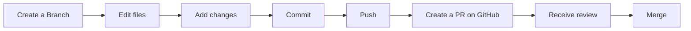
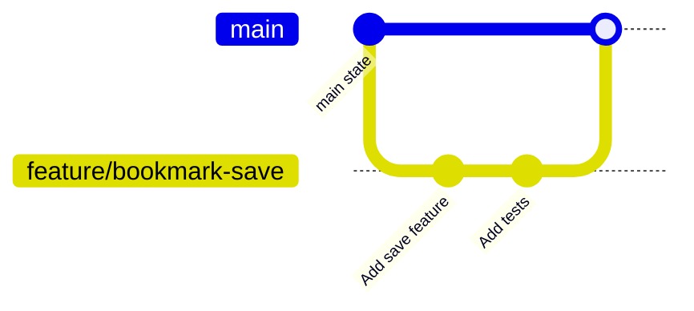

# GitHub Flow and PRs

## Goal

Learn pull request (Pull Request, hereafter PR) based development by trying the flow yourself.

This chapter starts with the overall workflow. After that, it explains what Branch, Commit, Push, Merge, and PR mean.

## Terms to Know First

GitHub Flow uses several Git terms repeatedly. You do not need to memorize every detail at first. Start with the following overview.

| Term | What it means | Common command |
| --- | --- | --- |
| Repository | A place that stores files and their change history | `git clone` |
| Branch | A place to work separately from the main line | `git checkout -b branch-name` |
| Commit | A saved unit of change history | `git commit -m "message"` |
| Staging / Add | Selecting changes to include in a Commit | `git add file-name` |
| Push | Sending local Commits to GitHub | `git push` |
| PR | A GitHub page for sharing changes and receiving review | Created on GitHub |
| Merge | Bringing changes from one Branch into another Branch | GitHub's Merge button, etc. |

The important point is that some operations happen in Git, while others happen on GitHub.

`git add`, `git commit`, and `git push` are commands you run in your terminal. PR creation and review usually happen on GitHub. Git commands alone do not create a GitHub PR review page.

## Try the Flow Locally First

Here, you will create a practice folder and initialize a small repository with `git init`. This is safer for beginners because it does not affect an existing project.

First, create a practice folder.

```bash
mkdir github-flow-pr-practice
cd github-flow-pr-practice
```

Initialize it as a Git repository.

```bash
git init
```

Create the first file.

```bash
echo "# GitHub Flow PR Practice" > README.md
```

Check the change.

```bash
git status
```

Commit the README.

```bash
git add README.md
git commit -m "Add README"
```

Check the current Branch name.

```bash
git branch --show-current
```

If it shows `master`, rename it to `main` for this course.

```bash
git branch -M main
```

Now you have a small practice repository. Next, create a working Branch.

```bash
git checkout -b practice/github-flow
```

`git checkout -b` creates a new Branch and moves you to it.

Update the README.

```bash
echo "" >> README.md
echo "Practice GitHub Flow." >> README.md
```

Check the change.

```bash
git status
git diff
```

`git status` shows which files changed. `git diff` shows the actual line-by-line difference.

If the change looks correct, select it for the next Commit.

```bash
git add README.md
```

To add multiple files at once, you can use:

```bash
git add .
```

However, `git add .` may include files you did not intend to commit. Check `git status` before and after running it.

Commit the change.

```bash
git commit -m "Add GitHub Flow practice note"
```

If you only changed files that Git already tracks, you can also use:

```bash
git commit -am "Add GitHub Flow practice note"
```

`git commit -a` does not include newly created files. For new files, run `git add file-name` first.

At this point, the local Branch and Commit practice is complete.

If you also want to try creating a PR on GitHub, create an empty repository on GitHub and add it as the remote for this local repository.

```bash
git remote add origin git@github.com:your-user-name/github-flow-pr-practice.git
```

Then Push both `main` and the working Branch to GitHub.

```bash
git checkout main
git push -u origin main
git checkout practice/github-flow
```

```bash
git push -u origin practice/github-flow
```

Now your local changes have been sent to GitHub. However, the PR has not been created yet.

Create the PR on GitHub. You can use the prompt that appears after pushing, or open the `Pull requests` tab, click `New pull request`, choose `main` as the target Branch, and choose `practice/github-flow` as the source Branch.



After the PR is reviewed and looks good, Merge it on GitHub. Then update your local `main`.

```bash
git checkout main
git pull
```

After that, delete the merged working Branch from your local environment. `git branch -d` deletes a Branch that has finished its role.

```bash
git branch -d practice/github-flow
```

This is the basic GitHub Flow.

## Git and GitHub

Git and GitHub sound similar, but they have different roles.

**Git** is a tool for recording file change history. It lets you save who changed what, when, and how as Commits. You can undo mistakes and separate work with Branches.

**GitHub** is a service for sharing Git repositories and collaborating as a team. GitHub provides PRs, code review, Issues, Actions for automated checks, and other collaboration features.

Git alone can manage local change history. In team development, however, you also need a way to share changes, decide who reviews them, and choose when they enter the main line. That is why GitHub PRs are used.

## Branches

A Branch lets you work on changes separately from the main line.

Many repositories treat the `main` Branch as the stable main line. If you Commit directly to `main`, unfinished or unreviewed code can enter the main line.

Instead, create a Branch for each piece of work.

```bash
git checkout -b feature/bookmark-save
```

Commits on this Branch do not affect `main` yet. When the work is ready, you create a PR, receive review, and then merge the change into `main`.



It is helpful to think of a Branch as a temporary workspace. After the work is merged into `main`, the Branch has finished its role.

## What Is a PR?

A PR is a request to bring changes from one Branch into another Branch.

In a PR, you can review:

- which files changed
- what the diff looks like
- why the change was made
- whether tests and CI passed
- what reviewers commented on
- whether the change should be merged into `main`

A PR is not created inside your local Git repository. It is a review page created on GitHub after you Push a Branch to GitHub.

A PR is not just a merge request. It is a place to collect the purpose, content, verification results, and review discussion for a change.

## Why Develop with PRs?

PR-based development helps teams share changes safely.

First, it makes changes visible. A PR shows the diff, so reviewers can understand what changed from the Commit history and file changes.

Second, it enables review. Someone other than the implementer can notice missing considerations, mismatches with the requirements, and possible effects on existing features.

Third, it can run CI. CI is a system that automatically runs tests, lint, builds, and similar checks. Automated checks can catch issues that human review may miss.

Fourth, it leaves decision history. A PR records why the implementation was chosen, what feedback was given, and what was checked before Merge. This is useful when changing the same area later.

With PR-based development, changes are not added to the main line immediately. They are checked first, which makes team development safer.

## What Makes a PR Easy to Review?

Easy-to-review PRs share several traits.

- The purpose is clear
- The change is small
- Unrelated formatting or refactoring is not mixed in
- Verification steps are written down
- Specific review points are shown

First, the purpose should be clear. When the PR description explains what problem the change solves, reviewers can understand the context before reading the diff.

Second, the diff should be small. When the scope is focused, reviewers can concentrate. It is also important to avoid mixing unrelated formatting or refactoring.

### Benefits of Small PRs

Smaller PRs are easier to review.

For example, if one PR includes UI changes, an API addition, database schema changes, and a large refactor, reviewers may not know what to focus on.

The comparison looks like this.

| Comparison Point | Too-Large PR | Small PR |
| --- | --- | --- |
| Purpose | Multiple purposes make the explanation vague | One focused purpose |
| Diff | Large diff that takes time to read | Small diff that is easy to follow |
| Review | Many review angles, so review is easy to postpone | Clear review points and faster review |
| Fixes | Feedback can affect a wide area | Rework stays small |
| Merge | More likely to conflict with other changes | Easier to merge |

As a rule of thumb, if you cannot describe the PR in one sentence, consider splitting it.

A good example is "Show OGP images in the bookmark list." A vague example is "Improve various bookmark features." The latter is too broad and makes it hard to know what should be reviewed.

### What to Write in the PR Description

A PR is also easier to review when verification steps are written down. For example, writing "`npm test` was run" or "confirmed that bookmarks can be added from the screen" helps reviewers check the same points.

At minimum, a PR description should include the following.

```markdown
## Purpose

Explain why this change is needed.

## Changes

List what changed.

## Verification

Write the commands or screen operations you used to verify the change.

## Review Points

Write what you especially want reviewers to check or what you are unsure about.
```

A PR is not only a place to show code. It is a communication space that helps reviewers understand the background and review the change appropriately.
