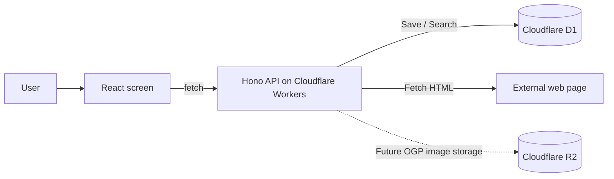

# The Feature You Will Build

## Goal

Understand the overview of the demo application used in this hands-on.

In this chapter, you first nail down what you are going to build on top of an existing demo application. Detailed environment setup and how to start the app are covered in the next chapter, "Preparing the Development Environment."

You can check the demo application at the following URLs.

- Demo application: [https://bookmark-demo.goofmint.workers.dev/](https://bookmark-demo.goofmint.workers.dev/)
- Repository: [https://github.com/goofmint/bookmark-demo](https://github.com/goofmint/bookmark-demo)

## What is Bookmark Demo?

Bookmark Demo is a personal bookmark application for saving URLs and revisiting them later.

In its current state, the application mainly supports the following operations.

- Add a bookmark by entering a URL
- Edit the URL, tags, and notes of a saved bookmark
- Delete unneeded bookmarks
- Search by keyword across URL, title, tags, and notes
- Display the bookmark list page by page

When you add a bookmark, the server fetches the HTML of the linked page, reads its `<title>`, and saves it as the title. Even if fetching the title fails, the URL is saved as the title.

## What You Will Build in This Hands-On

In this material, you will implement an OGP fetching feature for Bookmark Demo.

OGP is the page summary information that is displayed when you share a URL on social media and similar services. For pages that have an OGP image, you will make it possible to fetch that image and show it on the bookmark.

In this chapter, you first understand what feature will be added. The implementation steps and local environment setup are covered step by step starting from the next chapter.

## Technologies Used

Bookmark Demo is a web application that builds its screens with React, builds its API with Hono, and runs on Cloudflare Workers. The frontend and the API run as a single application.

| Technology | Its role in this application |
| --- | --- |
| [React](https://react.dev/) | Builds the screens in the browser |
| [Vite](https://vite.dev/) | Develops and builds the React application |
| [TypeScript](https://www.typescriptlang.org/) | Writes JavaScript safely using types |
| [Hono](https://hono.dev/) | Builds the API on Cloudflare Workers |
| [Cloudflare Workers](https://developers.cloudflare.com/workers/) | A serverless runtime that runs the API and serves static files |
| [Cloudflare D1](https://developers.cloudflare.com/d1/) | A SQLite-based database that stores bookmarks |
| [Cloudflare R2](https://developers.cloudflare.com/r2/) | Object storage prepared for saving OGP images |
| [Wrangler](https://developers.cloudflare.com/workers/wrangler/) | A CLI for operating Cloudflare Workers, D1, and R2 |
| [Vitest](https://vitest.dev/) | Runs API and UI tests |

## System Architecture

The overall flow of the application is as follows.

When displaying the bookmark list, the React screen calls `/api/bookmarks`. The API reads the bookmarks from D1 and returns them as JSON.

When adding a bookmark, the React screen sends the URL to the API. The API normalizes the URL, fetches the `<title>` of the linked page, and saves it to D1.

## Why Use This Subject

This application bundles the screen, API, database, and tests together. Even though it is small, it is easy to follow the flow of changes that happen in a real web application, which makes it easy to use as a learning subject.

In this material, you first understand the overall picture of the feature to implement, and then set up the actual local environment in the next chapter, "Preparing the Development Environment."
