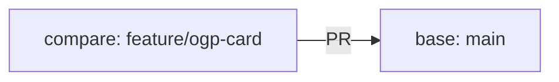

# Create a PR

## Goal

Share the implemented changes as a pull request (Pull Request, hereafter PR) so they can be reviewed.

## Create a Feature Branch

Before creating a PR, create a working Branch. Treat `main` as the main line and avoid putting unfinished changes directly into it.

First, check the current Branch.

```bash
git branch --show-current
```

If you are on `main`, get the latest changes and create a working Branch.

```bash
git pull
git checkout -b feature/ogp-card
```

`feature/ogp-card` is an example Branch name. Use a name that makes the work understandable.

| Purpose | Example Branch Name |
| --- | --- |
| Add a feature | `feature/bookmark-search` |
| Fix a bug | `fix/empty-title-error` |
| Update documentation | `docs/github-flow-guide` |
| Refactor code | `refactor/bookmark-service` |

Branch naming rules may differ by team. If your project already has a naming rule, follow it.

## Create a Commit

After implementation, create a Commit. A Commit is one unit of change history.

First, check which files changed.

```bash
git status
```

Then check the diff.

```bash
git diff
```

`git diff` shows which lines were added, changed, or deleted. Before committing, check that no unintended changes are included.

If everything looks correct, choose the files to include in the Commit.

```bash
git add src/components/BookmarkCard.tsx
git add src/components/BookmarkCard.module.css
```

To add all changes at once, you can use:

```bash
git add .
```

However, `git add .` adds changes under the current directory. Check `git status` first so unrelated files are not included.

Create the Commit.

```bash
git commit -m "Show OGP image in bookmark card"
```

If you only changed files that Git already tracks, you can also use:

```bash
git commit -am "Show OGP image in bookmark card"
```

`git commit -a` does not include newly created files. For new files, run `git add file-name` first.

Write Commit messages so that readers can understand what changed.

Good examples:

```text
Show OGP image in bookmark card
Add validation for empty URL
Add setup steps to README
```

Unclear examples:

```text
Fix
Update
Various changes
```

Commits remain as history. Future you and your teammates should be able to understand what each Commit did.

## Create a PR

After creating a Commit, Push the Branch to GitHub. Push sends your local Commits to the GitHub repository.

```bash
git push -u origin feature/ogp-card
```

Use `-u origin branch-name` on the first Push. After that, you can Push with:

```bash
git push
```

After pushing, GitHub may show a button to create a PR.

A PR is not created by local Git commands alone. First you create a Branch, Commit, and Push locally. Then you create the PR review page on GitHub.

If the PR creation button does not appear, follow these steps on GitHub.

1. Open the repository page
2. Open the `Pull requests` tab
3. Click `New pull request`
4. Select `main` as the base Branch
5. Select your working Branch as the compare Branch
6. Check the diff
7. Write the title and description
8. Click `Create pull request`

The base Branch is the target Branch. In many projects, it is `main`. The compare Branch is the Branch that contains your change.



Before creating the PR, read the diff on GitHub once. You may notice unintended changes or missing explanation that you missed locally.

## Describe the Implementation Intent

Write the implementation intent in the PR description. Reviewers cannot always understand why the change is needed from the code diff alone.

At minimum, include these four sections.

```markdown
## Purpose

Show OGP images so users can understand linked pages more easily in the bookmark list.

## Changes

- Add an OGP image area to the bookmark card
- Show a placeholder when no OGP image exists
- Fix the image size to prevent layout shifts

## Verification

- `npm run typecheck`
- `npm run build`
- Checked the bookmark list with and without OGP images

## Review Points

- Whether the no-image state is understandable
- Whether the image size matches the existing design
```

In "Purpose", write why the change is needed. In "Changes", write what you changed. In "Verification", write commands or screen operations you used. In "Review Points", write what you are unsure about or especially want reviewed.

Writing review points helps reviewers focus on the important parts. If you are unsure about the UI, say so. If you are unsure about the specification, write that too.

## Update the PR

When you receive review comments, fix the code on the same Branch.

```bash
git status
git diff
git add .
git commit -m "Address review feedback"
git push
```

Pushing to the same Branch adds the Commit to the existing PR. You do not need to recreate the PR.

If a reviewer asks a question, you can explain your intent before changing code. Review is a conversation for improving the change, not a one-way instruction.

## Check Before Merge

Before merging the PR, check the following.

- The PR purpose is written in the description
- No unrelated file changes are included
- CI is passing
- Required review is complete
- Feedback has been addressed, or the reason for not addressing it is explained
- The change has been verified locally or in the UI

If everything looks good, Merge it on GitHub. After Merge, the working Branch can be deleted.

Update your local environment too.

```bash
git checkout main
git pull
git branch -d feature/ogp-card
```

Even if you delete the working Branch, the PR and Commit history remain on GitHub.

## Common Issues

If you started working on `main`, and you have not committed yet, you can simply create a Branch at that point.

```bash
git checkout -b feature/forgot-branch
```

Even if you already committed, you can create a Branch that includes the current Commit.

```bash
git checkout -b feature/forgot-branch
```

If Push fails, check the Branch name and remote name.

```bash
git remote -v
git branch --show-current
```

If unwanted files are staged before Commit, remove them from staging.

```bash
git restore --staged file-name
```

Reverting actual file changes can have a larger effect. In team development, check the team's rules before rewriting history or discarding work.
