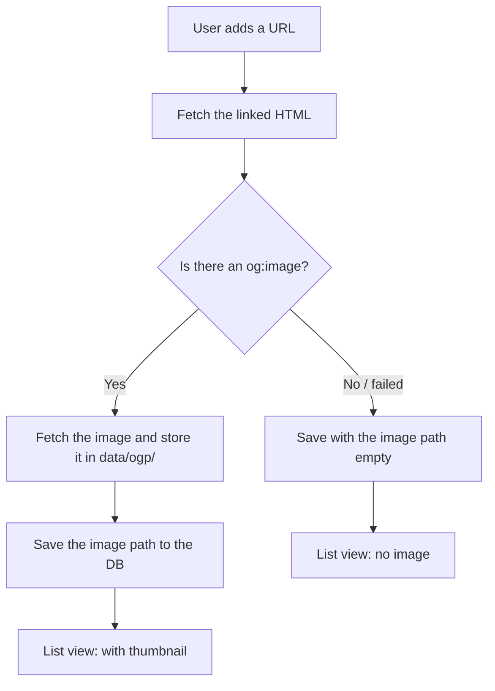

# Implement OGP Fetching

## Goal

Add a feature to Bookmark Demo that displays the OGP image as a thumbnail.

The goal of this chapter is **not** to write every line of code yourself. It is **to give the right instructions to an AI coding tool and produce a change that is easy to review**. When the implementation is done, the bookmark list will show images of the linked pages, and in the next chapter you will turn that change into a PR and receive a CodeRabbit review.

:::note[How to work through this chapter]
In this hands-on exercise you implement the feature using an AI coding tool (Claude Code, Cursor, GitHub Copilot, or any other — it does not matter which). This chapter provides **sample prompts** you can paste in as-is.

In case the AI cannot implement it well, the end of the chapter also provides [a way to download the finished version and swap it in](#fallback). If you get stuck, feel free to use that.
:::

## What is OGP? \{#what-is-ogp}

**OGP** (Open Graph Protocol) is a mechanism a web page uses to declare "when this page is shared on social media and the like, use this title, description, and image."

For example, when you paste a news article URL into X or Slack, a card with the article's image is shown. That is built by reading OGP information.

OGP is written inside the HTML `<head>` as `<meta>` tags like the following.

```html
<meta property="og:title" content="The article title" />
<meta property="og:description" content="The article summary" />
<meta property="og:image" content="https://example.com/cover.png" />
```

This time, of these, we fetch **`og:image` (the representative image of the page)** and display it as a thumbnail in the bookmark list.

:::note[Why store the image instead of using it directly]
If you point an `` directly at another site's image URL, the moment that site deletes or replaces the image, your display breaks too. To avoid this, this time we **copy the image to local storage (`data/ogp/`) once and then display it**. This folder is created automatically when the app starts.
:::

## Scope of This Implementation \{#scope}

This time we add the following five things.

| # | What to do | Mainly changed files |
| --- | --- | --- |
| 1 | Add a column to bookmarks that stores the OGP image path | `migrations/0003_add_ogp_image.sql` (new) |
| 2 | Create the process that fetches an OGP image from a URL and stores it locally | `src/server/ogp.ts`, `src/server/storage.ts` |
| 3 | Call 2 when adding/updating a bookmark, and add an API to serve the image | `src/server/app.ts`, `src/shared/bookmarks.ts` |
| 4 | Show the thumbnail on the list screen | `src/client/App.tsx`, `src/client/styles.css` |
| 5 | Add tests for 1–4 | `test/ogp.test.ts` (new) and others |

The feature policy is as follows. This becomes the "spec" you hand to the AI, so make sure you understand it well.

- OGP image fetching is **best-effort**. Even for a page with no image or where fetching fails, saving the bookmark itself must always succeed.
- When there is no image, set the OGP image path to an **empty string** and do not show a thumbnail in the list.
- Only store **real image files (PNG/JPEG/WebP/GIF/AVIF)**. Do not store files that are too large.
- Do not expose saved images directly. Serve them through the `/ogp/:name` API.

## The Overall Implementation \{#flow}

The flow when a bookmark is added looks like this.



## Preparing for AI Coding \{#prepare-ai}

Confirm that all the steps in [Prepare the Development Environment](environment-setup) are finished. The prerequisite is that the app can start locally.

Next, create a working Branch. Keep `main` as-is and make changes on a dedicated Branch.

```bash
git checkout main
git pull
git checkout -b feature/ogp-image
```

Open your AI coding tool in this `bookmark-demo` folder.

:::note[Tip for telling the AI the context]
Adding a sentence about "what kind of app this is" at the start of the prompt improves the AI's accuracy. It is good to prepend the following sentence to each prompt.

> This is a local bookmark app running on Node.js + Hono + React + SQLite. The database is `data/bookmarks.sqlite`, and OGP images are stored under `data/ogp/`. Match the existing code's style and comment granularity.
:::

## Sample Prompts \{#prompts}

From here are the sample prompts per step. Run them **one at a time, in order**, and check the changes with `git diff` each time. Splitting it into steps rather than asking for everything at once makes the AI's implementation more stable and easier to review.

### Step 1: Add a column to the database

```prompt
Create a new migration named 0003_add_ogp_image.sql in the migrations folder.
Add a TEXT column called ogp_image_url to the bookmarks table.
Make it NOT NULL with a default value of the empty string ''.
Existing rows and the seed data have no og:image, so explain in a comment
that the empty string is fine for them.
```

Once created, the migration is applied automatically the next time the server starts.

### Step 2: The process that fetches and stores the OGP image

```prompt
Update src/server/ogp.ts and src/server/storage.ts as needed. Provide the following functions.

1. extractOgImageUrl(html, baseUrl): extract the first og:image URL from an
   HTML string.
   - Scan <meta> tags and find one whose property or name is "og:image"
     ("og:image:url" is also acceptable)
   - Take the value of the content attribute
   - Resolve relative URLs against baseUrl into absolute URLs
   - Return null for anything other than http/https
   - Return null if none is found

2. storeOgpImage(pageUrl, storageDir, fetcher = fetch): the return value is a string.
   - Fetch the HTML of pageUrl (5-second timeout, send a User-Agent)
   - Return "" if the content-type is not text/html
   - Get the image URL with extractOgImageUrl; return "" if none
   - Fetch the image; return "" if the content-type is not one of
     image/png, image/jpeg, image/webp, image/gif, image/avif
   - Return "" if the size is 0 or over 5MB
   - Use crypto.randomUUID() to create a <uuid>.<ext> filename and save it under `storageDir`
   - Return the stored path "/ogp/<uuid>.<ext>"
   - If anything fails, always return "" (so it does not block saving the bookmark)

Do not use classes; write in the same function style as the existing code.
Explain in comments why it returns "" and why image types are restricted.
```

:::note[Why take `fetcher = fetch` as an argument]
So that in tests you can inject fake responses without making real network requests. If you tell the AI "design it to be testable," it adds this kind of consideration.
:::

### Step 3: Integrate with the API and serve the image

```prompt
Add ogpImageUrl: string to the Bookmark type in src/shared/bookmarks.ts.

Change src/server/app.ts as follows.
- Add ogp_image_url / ogpImageUrl to the BookmarkRow type and toBookmark
  (fall back to "" for existing rows)
- Add the ogp_image_url column to the list/create/update SQL
- In POST /api/bookmarks and PUT /api/bookmarks/:id, before saving call
  storeOgpImage(url, storageDir) and save its return value as ogp_image_url
- Add a GET /ogp/:name route. Read the locally saved image; return 404 JSON if
  missing, otherwise return it carrying over the content-type.
  Add cache-control: public, max-age=86400, immutable

Always keep the design where bookmark saving succeeds even if OGP fetching fails.
Match the way the existing comments are written.
```

### Step 4: Show the thumbnail in the list

```prompt
In src/client/App.tsx, in the part that displays a single bookmark (the normal
display, not the edit form), show an  only when bookmark.ogpImageUrl exists.
- className="bookmark-thumb", alt="", aria-hidden="true", loading="lazy"
- Show nothing when there is no image

Add a .bookmark-thumb style to src/client/styles.css.
- Fixed width 120px and height 90px, object-fit: cover, rounded corners,
  a thin border
- Use :has(.bookmark-thumb) so an image column appears only when a thumbnail exists
- Adjust to a slightly smaller size at phone widths
Do not break the existing layout (grid).
```

### Step 5: Add tests

```prompt
Add the following tests with Vitest.

test/ogp.test.ts (new)
- extractOgImageUrl: absolute URL extraction / relative URL resolution /
  null when no og:image / excluding non-http(s)
- storeOgpImage: stores the image and returns the path / "" when no og:image /
  "" for a disallowed content-type / "" when the page fetch fails
  (pass a fake fetch to the fetcher argument so it does not make network requests)

In test/worker.test.ts, add that ogp_image_url is saved on creation, that
GET /ogp/:name returns the image, and that it returns 404 when missing.

In test/App.test.tsx, add that the thumbnail is shown when ogpImageUrl exists
and not shown when it does not.

Match the way the existing tests and mocks are written.
```

Once the implementation is roughly done, run the build and the tests.

```bash
npm run build
npm test
```

`npm run build` also doubles as a type check. If an error appears, paste the message as-is to the AI and tell it "fix this error," and it will fix it.

## Tips for AI Coding \{#tips}

- **Do not ask for everything at once.** Split into steps and check with `git diff` each time. The smaller the diff, the sooner you notice mistakes.
- **Do not leave the spec vague.** Instead of "do it nicely," hand over decision criteria in words, such as "return an empty string on failure."
- **Hand over errors in full.** Pasting the terminal error text as-is is the fastest way to get it fixed.
- **Do not let it break what works.** Make explicit what you want protected, such as "do not change the behavior of the existing list API."
- **Do not blindly trust the AI's implementation.** You will receive a CodeRabbit review afterward. Read the `git diff` yourself so you can explain it.

## When It Does Not Work: Swap In the Finished Version \{#fallback}

When the AI's implementation just will not pass, you can fetch and swap in the finished code. **You can also use it as an answer key.**

The finished version is on a Branch called `feat/ogp-image` in the demo repository.

- Reference: [https://github.com/goofmint/bookmark-demo/tree/feat/ogp-image](https://github.com/goofmint/bookmark-demo/tree/feat/ogp-image)

### 1. Download as a Zip

Opening the following URL in your browser downloads the contents of the `feat/ogp-image` Branch as a Zip.

```text
https://github.com/goofmint/bookmark-demo/releases/download/ogp/ogp.zip
```

When you unzip the downloaded file, a folder named `ogp` is created. This is the **complete finished code**. Keep it in a different location from your own `bookmark-demo` folder.

:::note[Downloading from the GitHub screen]
If the URL above is confusing, open the [repository page](https://github.com/goofmint/bookmark-demo), select OGP from the Releases on the right, and click the **"ogp.zip"** link under Assets to download it.
:::

### 2. Swap the Folders

This time's changes all fit inside the following folders and files. Use these folders and files from the extracted folder to **replace wholesale** the same folders and files in your own `bookmark-demo` folder.

| Folders and files to replace | Contents |
| --- | --- |
| `src` | Screen and API code |
| `migrations` | Database blueprints (`0003` is added) |
| `test` | Test code |
| `vite.config.ts` | Vite configuration (changed to serve OGP images) |
| `vitest.config.ts` | Vitest configuration (changed to serve OGP images) |

### 3. Apply and Verify

Once swapped, run the build and the tests.

```bash
npm run build
npm test
```

If both finish without errors, the swap succeeded.

## Verify \{#verify}

Start the local server.

```bash
npm run dev
```

Open the displayed Vite URL (such as `http://127.0.0.1:5173`) in your browser and check the following.

- When you add a URL of a page that has an OGP image (a news or blog article, etc.), a thumbnail appears in the list
- Even when you add a page with no OGP image, it does not error and the bookmark is saved (no thumbnail appears)
- Editing, deleting, and searching existing bookmarks works as before

Once verified, stop the server with `Ctrl + C`.

## Summary So Far

In this chapter you used AI coding to implement OGP fetching in Bookmark Demo.

- Understood the role of OGP (especially `og:image`)
- Implemented it with sample prompts split into steps
- Made it possible to fetch the finished version as a Zip and swap it in when stuck
- Verified the behavior with the build, tests, and the screen

In the next chapter, you commit this change, share it as a Pull Request (PR), and receive a CodeRabbit review.
