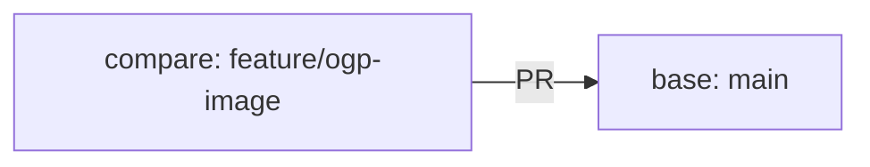

# Create a PR

## Goal of This Chapter

Take the changes you made in [Implement OGP Fetching](ogp-implementation), Commit them, Push them to GitHub, and turn them into a PR (Pull Request).

The goal of this chapter is to create a PR. Once the PR exists, you can receive a CodeRabbit review in the next chapter.

What Branch, Commit, Push, and PR each do was already explained in [GitHub Flow and PRs](github-flow-pr), so it is not repeated here. Here you put this OGP feature onto that flow for real.

## Check the Current State

In the previous chapter, you already created the working Branch (`feature/ogp-image`) and finished the implementation and verification on it. First, confirm that you are currently on that Branch.

```bash
git branch --show-current
```

If it shows `feature/ogp-image`, you are good. If it shows `main`, you may have skipped the Branch creation in the previous chapter. Redo it from the Branch creation step in [Implement OGP Fetching](ogp-implementation).

Next, check what changed.

```bash
git status
git diff
```

`git status` shows the list of changed and added files, and `git diff` shows the actual diff. Check here that only the files you touched in the previous chapter (`migrations/0003_add_ogp_image.sql`, `src/server/ogp.ts`, `src/server/storage.ts`, `src/server/app.ts`, `src/client/App.tsx`, tests, and so on) appear, and that no unintended files are mixed in.

## Create a Commit

This time the change is one coherent unit — adding the OGP feature — so put the related files into a single Commit.

Because there are newly created files (such as `0003_add_ogp_image.sql` and `ogp.ts`), add them explicitly with `git add`.

```bash
git add migrations/ src/ test/
```

Check again with `git status` that they were added, and if everything looks fine, Commit.

```bash
git commit -m "Show OGP images in the bookmark list"
```

Write the Commit message so that "what you did" is understandable when read later. Avoid messages like `Fix` or `Various changes` that say nothing about the content. This message can be reused as-is for the PR title.

## Push to GitHub

Send the Commit to GitHub. Since this is the first time you Push the `feature/ogp-image` Branch, add `-u origin feature/ogp-image`.

```bash
git push -u origin feature/ogp-image
```

By adding `-u` on the first Push, you can send this Branch with just `git push` from then on.

## Create a PR

When you open the GitHub repository page after pushing, it often shows a prompt to create a PR from `feature/ogp-image`, so click it.

If the prompt does not appear, do the following on GitHub.

1. Open the repository page
2. Open the `Pull requests` tab
3. Click `New pull request`
4. Select `main` as the base Branch
5. Select `feature/ogp-image` as the compare Branch
6. Check the diff

The base is the "target to merge into", and the compare is the "Branch that contains your change". This time the direction is as follows.



If you select base and compare the other way around, the diff becomes empty or you get an unintended comparison. Confirm here that the direction is `main` ← `feature/ogp-image`.

Once the diff is confirmed, write the title and description.

### Describe the Implementation Intent

Make the title a single sentence that conveys the change at a glance. The Commit message you just wrote (`Show OGP images in the bookmark list`) is good enough to use as-is.

How to write the description was explained in [GitHub Flow and PRs](github-flow-pr). For this OGP feature, write something like this.

```markdown
## Purpose

Show OGP images as thumbnails so users can grasp the content of linked pages more easily in the bookmark list.

## Changes

- Added a migration that adds the `ogp_image_url` column
- Added processing that fetches the OGP image from a URL and stores it locally
- Fetch and store the OGP image when creating or updating a bookmark
- Show thumbnails in the list screen
- Added tests for the above

## Verification

- `npm run build`
- `npm test`
- Added URLs both with and without OGP images on the screen and confirmed display and saving

## Review Points

- Whether saving a bookmark still succeeds even if OGP fetching fails
- Whether the allowed image types and size limit are appropriate
```

Writing "Verification" and "Review Points" lets the reviewer (CodeRabbit in the next chapter) know what to focus on, making the review faster and more accurate.

### Finalize the PR

Once the title and description are written, click `Create pull request`. The PR page is created, with the diff, Commits, and description all in one place.

At this point, the goal of this chapter is achieved.

## Common Stumbling Points

`git push` errors out

If on the first Push you run just `git push` without `-u origin feature/ogp-image`, the destination is not set and it errors. Run it with `-u` the first time.

```bash
git push -u origin feature/ogp-image
```

Newly created files are not in the Commit

`git commit -am` only includes files Git already tracks. This time there are new files such as `0003_add_ogp_image.sql` and `ogp.ts`, so this would miss them. Run `git add` on new files first, then Commit. After the Commit, you can check the files actually included in that Commit with the following command.

```bash
git show --name-only --oneline HEAD
```

If all the files you intended are listed, you are fine.

Unrelated files are mixed into the diff

`git status` or `git diff` may show files unrelated to this change (such as locally generated artifacts). Exclude anything you do not want in the Commit before running `git add`. If you already staged it, you can unstage it with the following command.

```bash
git restore --staged file-name
```

The PR diff is empty, or shows changes you don't recognize

Almost always this means base (the target) and compare (the source) were selected the other way around. Confirm that base is `main` and compare is `feature/ogp-image`.

## Summary So Far

In this chapter you turned the OGP feature change into a PR.

- Checked the state of `feature/ogp-image` created in the previous chapter
- Committed including the new files
- Pushed to GitHub and created a PR pointing at `main`
- Wrote a PR description that conveys the implementation intent

You are now ready to receive a review. In the next chapter, you receive a CodeRabbit review on this PR and work through its feedback.
