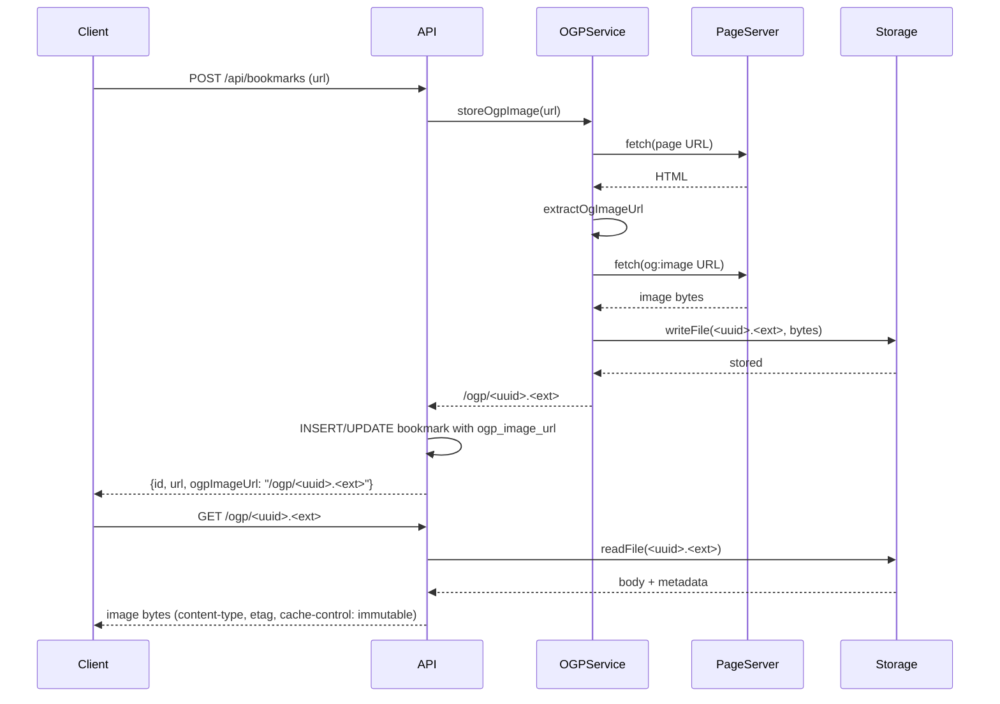

# Experience a CodeRabbit Review

## Goal

After creating a PR in [Create a PR](create-pull-request), we look at what happens on the GitHub screen.

When you open a PR, CodeRabbit automatically starts a review. In this chapter you will experience the whole cycle—**read the review → understand what it means → respond → receive another review**—while looking at a real sample PR.

## Open the Sample PR

This chapter uses a PR for the same OGP feature you implemented in the previous chapter. If you have your own PR at hand, follow along with it; if not, open the sample PR below and read along.

- Sample PR: [https://github.com/goofmint/bookmark-demo/pull/6](https://github.com/goofmint/bookmark-demo/pull/6)

This PR has an actual CodeRabbit review on it. The explanations below use the contents of this PR directly as the example.

## When the Review Starts

Right after you create a PR, or right after you push a new commit to a PR, CodeRabbit starts a review automatically. You do not need to trigger it yourself.

A review takes a few minutes. When it finishes, two kinds of output appear on the PR.

1. **One large comment on the whole PR** (summary and overview)
2. **Comments tied to specific lines of the code diff** (inline comments—per-line feedback)

Let's look at them in order.

## Read the Overview Comment

First, the large comment near the top of the PR screen. This is where "what this PR does as a whole" is summarized. **Getting the overall picture of the change here, before tracing the diff line by line**, is the trick to reading a review.

This comment is made up of the following parts. We will look at them in order.

### Summary by CodeRabbit

A short, human-oriented summary that classifies the changes into categories such as "New Features" and "Tests."

> * **New Features**: Show a thumbnail for bookmarks that have an OGP image. Images are lazy-loaded and responsive, served through a new image delivery endpoint. The thumbnail URL is stored in the DB.
> * **Tests**: Added E2E/unit tests that verify thumbnail extraction, storage, delivery, and whether it is displayed.
> * **Chores**: Updated `.gitignore` to exclude a temporary directory.

### Walkthrough

A prose summary of the entire change.

> Added a required `ogpImageUrl` to the DB, processing for OGP extraction and local storage, an API endpoint to store and serve images, the client implementation and CSS for thumbnail display, and tests for whether it is displayed.

### Changes

A table that organizes, one line at a time, what was done in which file. You can size up the scope of the change here before opening the diff.

| Target file | Content |
| --- | --- |
| `src/shared/bookmarks.ts`, `migrations/0003_add_ogp_image.sql`, `src/server/app.ts` | Added a required `ogpImageUrl` to the `Bookmark` type. Added an `ogp_image_url` column (NOT NULL, default `''`) via migration. Reflected the column in the API's list query. |
| `src/server/ogp.ts`, `src/server/storage.ts`, `test/ogp.test.ts` | Added `extractOgImageUrl` / `fetchWithTimeout` / `storeOgpImage`. Extracts og:image, validates MIME and size, stores the image as a local file, and returns a delivery path or an empty string. Tests added too. |
| `src/server/app.ts`, `test/worker.test.ts` | Calls `storeOgpImage` on POST/PUT and serves the saved image via `GET /ogp/:name`. Tests added too. |
| `src/client/App.tsx`, `src/client/styles.css`, `test/App.test.tsx` | Shows a lazy-loaded thumbnail only when `ogpImageUrl` exists. Added CSS and a test for whether it is displayed. |
| `.gitignore` | Added `.tmp` to the exclusion list. |

### Sequence Diagram

The flow of processing is shown as a diagram (sequence diagram).



You can follow the flow of "register URL → fetch page → extract og:image → store locally → show in list" without reading the code.

### Estimated code review effort

An estimate of how much effort reviewing this PR will take.

> 🎯 3 (Moderate) | ⏱️ ~20 minutes

This means difficulty 3 (moderate), about 20 minutes required.

### Possibly related PRs

Past PRs that seem related to this change are listed. This helps you grasp the background. The sample PR lists the following two.

> - bookmark-demo#1: The PR that this one extends, which laid the foundation of the bookmark app.
> - bookmark-demo#3: A PR that touches the same bookmark data model and the list/edit UI.

### Pre-merge checks

The results of automated checks on whether it is OK to merge. In the sample PR, four items pass and one is a warning.

> 🚥 Pre-merge checks ｜ ✅ 4 ｜ ❌ 1
>
> **Warning (1)**
>
> | Check name | State | Content |
> | --- | --- | --- |
> | Docstring Coverage | ⚠️ Warning | Docstring coverage is 0.00%, which is insufficient. The required threshold is 80.00%. Write docstrings for the functions that are missing them. |
>
> **Passed (4)**
>
> | Check name | State | Content |
> | --- | --- | --- |
> | Description Check | ✅ Passed | Skipped because CodeRabbit's summary is valid. |
> | Title check | ✅ Passed | The title accurately summarizes the main change. |
> | Linked Issues check | ✅ Passed | Skipped because there is no linked issue. |
> | Out of Scope Changes check | ✅ Passed | Skipped because there is no linked issue. |

A warning does not stop the merge; it is a heads-up that says "there is something to be aware of." Whether to address it is your call.

## Read the Inline Comments (Per-line Feedback)

Next is the main body of the review. CodeRabbit attaches feedback to specific lines of code.

At the top of the review, it shows how many comments you should consider acting on, such as "**Actionable comments posted: 5**." The sample PR has five.

Each inline comment uses leading badges so you can tell the "type," "severity," and "effort to respond" at a glance. Let's look at a real example from the sample PR.

```text
⚠️ Potential issue | 🟠 Major | 🏗️ Heavy lift
Add SSRF guards before fetching page/image URLs.
```

The badges mean the following.

| Badge type | Examples | Meaning |
| --- | --- | --- |
| Type | `⚠️ Potential issue` / `🛠️ Refactor suggestion` / `🧹 Nitpick` | A suspected bug/vulnerability, an improvement suggestion, or a minor style nit |
| Severity | 🔴 Critical / 🟠 Major / 🟡 Minor / 🔵 Trivial / ⚪ Info | How serious it is |
| Effort to respond | `⚡ Quick win` / `🏗️ Heavy lift` | Whether it can be fixed quickly or needs a redesign |

For the example above, you can read it as "a suspected security issue (Potential issue)," "fairly serious (Major)," and "hard to address (Heavy lift)." Looking at the badges lets you immediately decide what to tackle first.

The body of the comment describes **what the problem is and why it is a problem**. Here are a few of the comments from the sample PR.

- **No SSRF protection** (Major / security): Because the user-provided URL is fetched as is, internal networks or `localhost` could be targeted.
- **Registration/update waits for OGP fetching to complete** (Major / performance): If fetching the external page is slow, the bookmark registration response is delayed by that much. A design that saves first and fetches the image afterward is preferable.
- **Scanning stops the moment one invalid `og:image` is found** (Minor): A valid `og:image` later on cannot be picked up.

In this way, it points out—with reasons—aspects that are hard to notice from the code diff alone (security, performance, oversights).

## Apply Suggested Changes

Some comments even propose the fix code. The "scanning stops" comment in the sample PR comes with a **Committable suggestion** (a proposal you can apply as is) like the following.

```diff
-      if (resolved.protocol !== "http:" && resolved.protocol !== "https:") {
-        return null;
-      }
+      if (resolved.protocol !== "http:" && resolved.protocol !== "https:") {
+        continue;
+      }
```

For proposals like this, a **"Commit suggestion" button** appears on the GitHub screen. Pressing it adds the fix directly to the PR as a new commit. You can apply it with a single button, without writing code locally.

:::warning[Always read the diff before pressing the button]
You can apply it with one click, but a proposal is not always correct. **Read and understand what the proposal changes and how, yourself, before** applying it. If you drop in a proposal you do not understand, code you cannot explain later will remain in the PR.
:::

## Have AI Fix It (Prompt for AI Agents)

For comments without proposed code, or fixes that span multiple files, there is a collapsible section labeled `🤖 Prompt for AI Agents`. Open it and you will find an instruction you can paste directly into an AI coding tool (such as Claude Code or Cursor).

For example, the instruction in the sample PR begins like this.

```text
Verify each finding against current code. Fix only still-valid issues, skip the
rest with a brief reason, keep changes minimal, and validate.
```

This means "**verify each finding against the current code, fix only the ones that are still valid, skip the rest with a brief reason, keep changes minimal, and validate**." The point is that, rather than dumping everything on the AI, the instruction has "do not take it at face value—verify before fixing" built into it.

You hand this instruction to the AI to make the fix, check the result yourself, and then commit. The flow becomes: feedback → fix with AI → check it yourself.

## Respond and Receive Another Review

Once you have addressed the feedback, **commit the fix to the same branch and push** it. You do not need to recreate the PR.

```bash
git add .
git commit -m "Add SSRF protection and clean up tests"
git push
```

When you push, CodeRabbit automatically performs **another review**. If the previous feedback has been properly fixed, that comment is marked "✅ Addressed in commit xxxx" and treated as resolved. In the sample PR too, the migration rollback note and the test cleanup comments are marked addressed in later commits.

When there is no new feedback, CodeRabbit displays the following.

```text
No actionable comments were generated in the recent review. 🎉
```

Once you reach this point, the CodeRabbit review has reached a milestone.

## You Do Not Have to Fix Everything

Feedback is not an "absolute order you must obey."

- **Address Major and security issues (such as SSRF) with priority.** Their impact is large.
- **You may pick and choose among Nitpicks (minor comments).** The sample PR also has comments at the level of "adding a certain test case would be even better."
- **For anything you decide not to address, reply with the reason.** You can also talk to `@coderabbitai` in the comment thread to ask questions or discuss.

A review is not a one-way directive; it is a conversation aimed at making the change better. What matters is being able to explain in words "why I am not following this piece of feedback."

## Summary So Far

In this chapter you experienced a CodeRabbit review on GitHub after creating a PR.

- Grasped the overall picture of the change from the overview comment (Summary, Walkthrough, Changes, diagram)
- Judged priority from the inline comment badges (type, severity, effort to respond)
- Learned how to apply a Committable suggestion with a button and a Prompt for AI Agents with an AI
- Pushed to the same branch to receive another review and confirmed the addressed indicator
- Understood that you do not have to follow everything and may skip with a reason attached

In the next chapter, using the feedback you read here as material, we think one step deeper about "what makes a good review."
