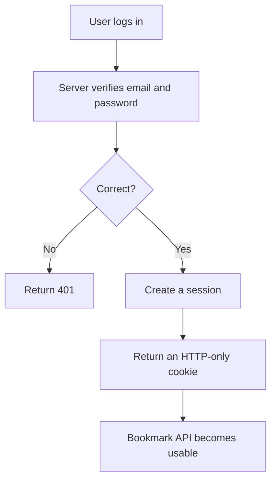
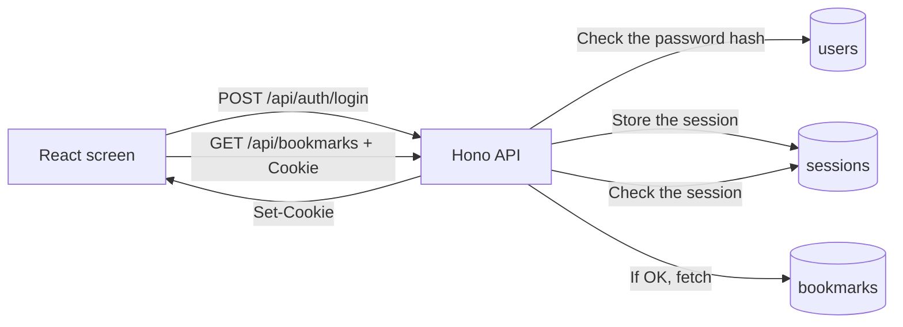

# Implement Authentication

## Goal

Add an authentication feature to Bookmark Demo so that **only logged-in users can use the bookmark feature**.

The goal of this chapter is **not** to write all of the authentication code yourself. It is **to give an AI coding tool the right implementation direction and to produce changes in units that are easy to review**. When the implementation is done, you will be able to experience the whole flow: a login screen, sign-up, login, logout, session checking, and protecting the API when not logged in.

:::note[How to Proceed in This Chapter]
For this chapter, either of the following approaches is fine.

- Use an AI coding tool (Claude Code, Cursor, GitHub Copilot, Codex, etc.) to implement it based on the sample prompts
- Download the finished diff file and swap it in for your local files

If your goal is to experience the IDE review in the next chapter, it is fine to use the finished diff and move ahead.
:::

## The Authentication Feature \{#feature}

This time, rather than OAuth login with an external service, we implement **login with an email address and password**, which is easier to handle as local teaching material.

When login succeeds, the server creates a random session token and stores it in the browser as an **HTTP-only cookie**. The React screen never reads the cookie's contents directly. On subsequent API requests, the browser sends the cookie automatically, and the server checks the session.



## Scope of This Implementation \{#scope}

This time we add the following five things.

| # | What to do | Mainly changed files |
| --- | --- | --- |
| 1 | Add tables that store users and sessions | `migrations/0004_add_auth.sql` (new) |
| 2 | Create the processing for password hashing, session creation, and cookie generation | `src/server/auth.ts` (new) |
| 3 | Add sign-up, login, logout, and login-state check APIs | `src/server/app.ts`, `src/shared/auth.ts` |
| 4 | Make the bookmark API unusable when not logged in | `src/server/app.ts` |
| 5 | Add a login screen and display that depends on the auth state | `src/client/App.tsx`, `src/client/styles.css` |

The feature policy is as follows. This becomes the "spec" when you hand the implementation off to the AI, so make sure you understand it well.

- **Do not store passwords in plain text.** Hash them with something like Node.js's standard `crypto.scrypt` before storing.
- **Do not store session tokens in the database in plain text** either. Put the raw token in the cookie, and store a value hashed with something like SHA-256 in the DB.
- Give the cookie `HttpOnly`, `SameSite=Lax`, and `Path=/`. Do not require `Secure` in the development environment.
- Give sessions an expiration. Do not treat an expired session as logged in.
- If the bookmark API is called when not logged in, return `401 Unauthorized`.
- On logout, delete the session on the server side and also expire the cookie on the browser side.

:::warning[This Is Not a Complete Production-Grade Authentication System]
What we build in this chapter is an authentication feature as local teaching material. In a production service, there are additional things to consider, such as email verification, password reset, rate limiting, CSRF protection, audit logs, session rotation, and account lockout.
:::

## The Overall Implementation \{#flow}

Whether a user is logged in is determined by the session on the server side.



On the screen side, it first calls `GET /api/auth/me`. If logged in, it shows the bookmark screen; if not logged in, it shows the login form.

## Preparing for AI Coding \{#prepare-ai}

Confirm that all the steps in [Prepare the Development Environment](environment-setup) are finished. The prerequisite is that the app can start locally.

Next, create a working Branch. Keep `main` as-is and make changes on a dedicated Branch.

```bash
git checkout main
git pull
git checkout -b feature/auth
```

If you are implementing with an AI coding tool, open this `bookmark-demo` folder.

## Using the Finished Diff

If you do not want to implement the authentication feature yourself and instead want to experience the IDE review in the next chapter with the same material, you can get the authentication diff from the following ZIP.

- [https://github.com/goofmint/bookmark-demo/releases/download/auth/auth.zip](https://github.com/goofmint/bookmark-demo/releases/download/auth/auth.zip)

Unzip it and apply it to your `bookmark-demo` working directory to get the state with the authentication feature added. After applying, open the `bookmark-demo` folder in VS Code and confirm that the Git changes are shown.

:::note[Tips for Giving the AI Context]
Adding a one-line description of "what kind of app this is" at the start of the prompt improves the AI's accuracy. It is good to prepend the following sentence to each prompt.

> This is a local bookmark app running on Node.js + Hono + React + SQLite. Match the existing code's style, type definitions, and the way tests are written. This time we add an authentication feature, but implement it with an email address and password and an HTTP-only cookie session, not external OAuth.
:::

## Sample Prompts \{#prompts}

From here are the sample prompts per step. Run them **one at a time, in order**, and check the changes with `git diff` each time.

The key is not for a human to write out all of the SQL and function bodies in advance. Have the AI agent first read the existing code, then implement in line with the project's conventions. In the prompts, convey only "what you want to achieve" and "the non-negotiable conditions."

### Step 1: Implement Server-Side Authentication

```prompt
Read the existing server implementation, migrations, and tests, then add an
authentication feature that lets users log in with an email address and password.

What I want to include:
- The DB migration needed for authentication
- APIs for account creation, login, logout, and login-state check
- Making the bookmark API require authentication

What I want you to follow:
- Do not store passwords in plain text
- Do not store session tokens in the DB in plain text either
- Give the cookie HttpOnly / SameSite=Lax / Path=/
- Make it runnable from http://127.0.0.1 in local development
- On login failure, make it impossible to tell from the outside whether the
  email address exists
- Do not change the behavior of the existing bookmark API when logged in
```

:::note[Why Not Let React Read the Cookie]
Adding `HttpOnly` makes the cookie unreadable from JavaScript. Because the React screen never handles the token directly, it becomes harder to steal the session token if an XSS occurs.
:::

### Step 2: Build the Auth Flow into the Screen

```prompt
Check the existing React screen and make the display switch naturally depending
on the auth state.

The user experience I expect:
- When not logged in, the user sees the login / account creation screen, not the
  bookmark list
- After a successful login or account creation, the user can enter the existing
  bookmark screen
- While logged in, it is clear which email address is being used
- The user can log out, and after logout the bookmark list is not visible
- If the session expires or a 401 response is received, return to the login screen

The conditions I want you to follow:
- Do not heavily rework the UI of the existing bookmark operations
- For API calls that use cookies, specify credentials: "include" as needed
- Make the styling blend in with the existing screen
- Make it practical as an operation screen, not a flashy landing page
```

### Step 3: Add Tests

```prompt
Add tests for the authentication feature.

First, check the existing test structure and match the same granularity and style.

What I especially want to verify:
- The shared processing that safely handles passwords and session tokens is not
  broken
- Account creation, login, logout, and login-state check work as expected
- The bookmark API cannot be used when not logged in
- When logged in, the existing bookmark API can be used as before
- On the screen, the display switching for not-logged-in, after-login, and
  after-logout can be verified

Decide the test target file names and how to split them in line with the existing
test structure.
```

Once the implementation is roughly done, run the build and the tests.

```bash
npm run build
npm test
```

`npm run build` also doubles as a type check. If an error appears, paste the message as-is to the AI and tell it "fix this error," and it will fix it.

## Verify \{#verify}

Start the local server.

```bash
npm run dev
```

Open the displayed Vite URL (such as `http://127.0.0.1:5173`) in your browser and check the following.

- The login form is shown first
- You can create a new account
- After logging in, the bookmark list is shown
- Adding, editing, deleting, and searching bookmarks works as before
- Logging out returns you to the login form
- After logout, reloading the browser does not show the bookmark list

Once verified, stop the server with `Ctrl + C`.

## Summary So Far

In this chapter you used AI coding to implement an authentication feature in Bookmark Demo.

- Understood the flow of login with an email address and password
- Understood the roles of an HTTP-only cookie and a server-side session
- Implemented it with sample prompts split into steps
- Verified the behavior with the build, tests, and the screen

In the next chapter, you receive a CodeRabbit review of this change in the IDE, and experience the flow of reading the feedback and making fixes.
