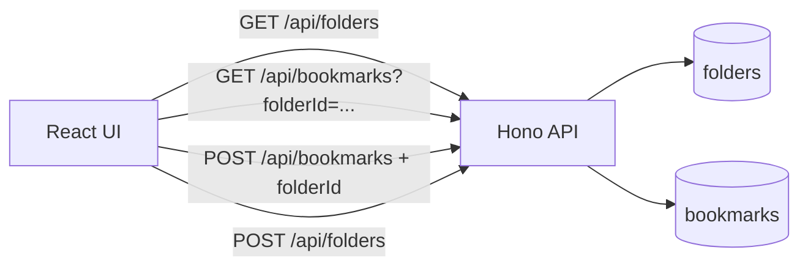

# Implement Folder Organization

## Goal

Add a feature to Bookmark Demo that organizes bookmarks into folders.

:::note[How to Proceed in This Chapter]
This chapter assumes you implement the feature using an AI coding tool (Codex CLI, Claude Code, Cursor, GitHub Copilot, and so on).
:::

## The Folder Feature \{#feature}

In the current Bookmark Demo, you can find bookmarks by tag or by search. To this, we add folders as a larger form of classification.

For example, this lets you organize bookmarks like the following.

| Folder | Example bookmarks to put in |
| --- | --- |
| Tech articles | Implementation know-how, official documentation, blog posts |
| Reading | Longer articles to read later |
| Work | Pages you reference for your job |
| Uncategorized | Bookmarks you have not classified yet |

A tag is a fine-grained classification, and a single bookmark can have several. A folder is a larger classification, and a single bookmark belongs to exactly one.

## Scope of This Implementation \{#scope}

This time we add the following five things.

| # | What to do | Mainly changed files |
| --- | --- | --- |
| 1 | Add a table to store folders and a column on bookmarks for the folder they belong to | `migrations/0005_add_folders.sql` (new) |
| 2 | Add APIs to list, create, update, and delete folders | `src/server/app.ts`, `src/shared/folders.ts` |
| 3 | Let the user choose a folder when creating or updating a bookmark | `src/server/app.ts`, `src/shared/bookmarks.ts` |
| 4 | Add folder selection, per-folder filtering, and a folder management UI to the screen | `src/client/App.tsx`, `src/client/styles.css` |
| 5 | Add tests for the API and the screen | `test/worker.test.ts`, `test/App.test.tsx`, and others |

The feature policy is as follows.

- Provide an Uncategorized folder in the initial state.
- After the migration, put existing bookmarks into Uncategorized.
- The Uncategorized folder cannot be deleted.
- When a folder is deleted, move the bookmarks that were in it to Uncategorized.
- Adding folder organization must not break the existing search, tag, add, edit, and delete operations.

## The Overall Implementation \{#flow}

When the screen opens, the React UI fetches the bookmark list and the folder list. The user switches what is shown from the folder list on the left or at the top, and chooses which folder a bookmark belongs to when creating or editing it.



On the server side, it JOINs the bookmark's `folder_id` with the folder table and returns the data in a form that is easy for the screen to display.

## Preparing for AI Coding \{#prepare-ai}

Confirm that all the steps in [Prepare the Development Environment](environment-setup) are finished. The prerequisite is that the app can start locally.

Next, create a working Branch. Keep `main` as-is and make changes on a dedicated Branch.

```bash
git checkout main
git pull
git checkout -b feature/bookmark-folders
```

Open your AI coding tool in this `bookmark-demo` folder.

:::note[Using the Prepared Sample]
A prepared sample that supports this chapter's folder organization feature is available as the following ZIP file.

https://github.com/goofmint/bookmark-demo/releases/download/folder/folder.zip

You can proceed by swapping the `src/test/migrations` included in this ZIP file with the `src/test/migrations` in your local project.
:::

## Sample Prompts \{#prompts}

From here are the sample prompts per step.

### Step 1: Implement the database and the API

```prompt
Check the existing server implementation and database structure, and implement only the "database" and "server API" needed to organize bookmarks into folders.

In this step, change only the following files. Do the changes to the screen (React) and the addition of tests in separate steps, so do not do them in this step.

- Migration: add a folder table and a column on bookmarks for the folder they belong to
- Shared type definitions: add a folder type (`src/shared/`)
- Server API: listing, creating, renaming, and deleting folders, and specifying a folder when creating or updating a bookmark (`src/server/app.ts`)

Make it possible to list, create, rename, and delete folders. Treat existing bookmarks as uncategorized, and make sure that deleting a folder does not delete the bookmarks themselves.

Change the existing search, tag, add, edit, and delete behavior as little as possible, and match how the current code is written. Do not change anything under `src/client/` or `test/` in this step.
```

### Step 2: Add folder operations to the screen

```prompt
Add a folder organization UI to the React screen.

When the user selects a folder on the screen, show only the bookmarks in that folder. Also let the user choose which folder a bookmark belongs to when adding or editing it.

Make it possible to create, rename, and delete folders within the same screen as well. Make the appearance blend in with the current bookmark screen.
```

### Step 3: Add minimal tests and verify

```prompt
Add tests for the folder organization feature.

Matching how the existing tests are written, make it possible to verify creating a folder, setting a folder on a bookmark, and filtering by folder.

Finally, run npm run build and npm test, and fix any failures.
```

```bash
npm run build
npm test
```

`npm run build` also doubles as a type check. If an error appears, check the message and fix it.

## Verify \{#verify}

Start the local server.

```bash
npm run dev
```

Open the displayed Vite URL (such as `http://127.0.0.1:5173`) in your browser and check the following.

- The Uncategorized folder is shown
- You can create a new folder
- You can choose a folder when creating a bookmark
- Selecting a folder shows only the bookmarks in that folder
- You can change the folder when editing a bookmark
- Deleting a folder moves its bookmarks to Uncategorized
- Search, tag, add, edit, and delete work as before

Once verified, stop the server with `Ctrl + C`.

## Summary So Far

In this chapter you used AI coding to implement folder organization in Bookmark Demo.

- Organized the relationship between folders and bookmarks
- Implemented it with sample prompts split into three steps
- Verified the minimum behavior with the build, tests, and the screen
- Reached a state where you can organize bookmarks into folders

In the next chapter, you run a CodeRabbit CLI review on this change from the terminal.
